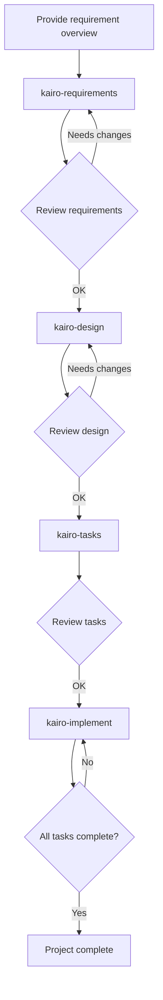

# Tsumiki Manual

## How to Use

### Setup

Before using the project, copy the contents of the `commands` directory into Claude's command directory:

````bash
# Copy the project's commands directory to ~/.claude/commands
cp -r commands ~/.claude/commands/

# Or, inside the project directory
mkdir -p .claude
cp -r commands .claude/
```bash

### TDD Commands

If your TASK is categorized as `TDD` and you want to run the TDD process step-by-step, execute the following commands in order:

````

# TDD requirements definition

/tdd-requirements <task-file> <TASK-ID>

# Create test cases

/tdd-testcases <task-file> <TASK-ID>

# Automate from test implementation to TDD completion check

/tdd-cycle-full.sh "<task-file> <TASK-ID>"

# Red (write failing tests)

/tdd-red <task-file> <TASK-ID>

# Green (minimal implementation)

/tdd-green <task-file> <TASK-ID>

# Refactor

/tdd-refactor <task-file> <TASK-ID>

# Verify TDD completion

/tdd-verify-complete <task-file> <TASK-ID>

```bash

### DIRECT Commands

If your TASK is categorized as `DIRECT`, run the following commands in order:

```

# DIRECT setup

/direct-setup <task-file> <TASK-ID>

# DIRECT verification

/direct-verify <task-file> <TASK-ID>

```bash

### Kairo Commands (End-to-End Flow)

#### 1. Requirements Definition

First, provide Kairo with a high-level requirement overview:

```

/kairo-requirements <requirement-overview>

# Prompt example:

# "I want to implement a product review feature for an e-commerce site.

# Users can post 5-star ratings and comments on products,

# and browse reviews posted by other users."

```bash

Kairo generates:

- User stories
- Detailed requirements using EARS notation
- Edge case considerations
- Acceptance criteria

Created file: `/docs/spec/{requirement-name}-requirements.md`

#### 2. Design

After reviewing and refining the requirements, request design generation:

```

/kairo-design # optional

# Tell Kairo the requirements have been approved

```bash

Kairo generates:

- Architecture design document
- Data flow diagrams (Mermaid)
- TypeScript interface definitions
- Database schema
- API endpoint specifications

Created files: under `/docs/design/{requirement-name}/`

#### 3. Task Decomposition

After reviewing the design (approval optional), decompose into tasks:

```

/kairo-tasks

# Tell Kairo the design has been approved (optional)

```text

It is recommended to run `/kairo-task-verify` to validate task content.

Kairo generates:

- Task list with dependencies
- Detailed task descriptions (including test and UI/UX requirements)
- Execution order and schedule

Created file: `/docs/tasks/{requirement-name}-tasks.md`

#### 4. Implementation

After confirming the tasks, start implementation.
(We recommend running the TDD cycle or DIRECT manually.)

```

# Implement all tasks in sequence

/kairo-implement

# Implement a specific task only

/kairo-implement <task-file> <TASK-ID>

# e.g., "Please implement TASK-101"

```

For each task, Kairo internally runs TDD commands in the following order:

1. TDD Requirements (`tdd-requirements`)
2. Test Case Creation (`tdd-testcases`)
3. Red (`tdd-red`)
4. Green (`tdd-green`)
5. Refactor (`tdd-refactor`)
6. TDD Completion Verification (`tdd-verify-complete`)

### Reverse Engineering Commands

To reverse-generate documents from an existing codebase, run the following commands in order:

```

# Analyze task structure from existing code

/rev-tasks

# Reverse-generate design documents (recommended after task analysis)

/rev-design

# Reverse-generate test specifications (recommended after design documents)

/rev-specs

# Reverse-generate requirements (recommended after all analyses)

/rev-requirements

````

#### Reverse Engineering Details

##### Overview

Reverse engineering commands analyze an existing codebase and produce documents by inferring from the implementation.

##### Recommended Execution Order

1. **rev-tasks** – Analyze the whole codebase to grasp the task structure
2. **rev-design** – Generate architecture and design documents
3. **rev-specs** – Generate test specifications and test cases
4. **rev-requirements** – Finally generate the requirements document

##### Command Details

###### rev-tasks (Task structure analysis)

**Purpose**: Extract and organize implemented features as tasks from the existing code

**Generated files**:

- `docs/reverse/{project-name}-discovered-tasks.md`

**Analysis content**:

- Understand the codebase structure
- Identify implemented features
- Extract API endpoints
- Analyze database structures
- Infer task dependencies

###### rev-design (Reverse-generate design documents)

**Purpose**: Generate technical design documents from the implemented architecture

**Generated files**:

- `docs/reverse/{project-name}-architecture.md`
- `docs/reverse/{project-name}-dataflow.md`
- `docs/reverse/{project-name}-api-specs.md`
- `docs/reverse/{project-name}-database.md`
- `docs/reverse/{project-name}-interfaces.ts`

**Analysis content**:

- Identify architecture patterns
- Extract data flows
- Extract API specifications
- Reverse-generate database schema
- Organize TypeScript type definitions

###### rev-specs (Reverse-generate test specifications)

**Purpose**: Reverse-generate test cases and specifications from implementation code

**Generated files**:

- `docs/reverse/{project-name}-test-specs.md`
- `docs/reverse/{project-name}-test-cases.md`
- `docs/reverse/tests/` – Generated test code

**Analysis content**:

- Analyze existing tests
- Identify missing test cases
- Generate API test cases
- Generate UI component tests
- Propose performance and security tests

###### rev-requirements (Reverse-generate requirements)

**Purpose**: Reverse-generate a requirements document using EARS notation from implemented features

**Generated files**:

- `docs/reverse/{project-name}-requirements.md`

**Analysis content**:

- Back-calculate user stories
- Classify requirements using EARS notation
- Infer non-functional requirements
- Identify edge cases
- Generate acceptance criteria

##### Usage Example

```bash
# Reverse-analyze the entire project
/rev-tasks
# → Grasp task structure

/rev-design
# → Document architecture and design

/rev-specs
# → Analyze current tests and identify gaps

/rev-requirements
# → Finally generate the requirements definition
````

##### Notes

- Always review the generated content at each step
- Inferred requirements may differ from actual business needs
- Since test cases are inferred from the implementation, they may be incomplete

## Directory Structure

```
/projects/ai/test18/
├── .claude/
│   └── commands/           # Kairo commands
├── docs/
│   ├── spec/               # Requirements definitions
│   ├── design/             # Design documents
│   ├── tasks/              # Task lists
│   └── reverse/            # Reverse-engineered docs
├── implementation/         # Implementation code
│   └── {requirement-name}/
│       └── {task-id}/
├── backend/                # Backend code
├── frontend/               # Frontend code
└── database/               # Database-related
```

## Workflow Example



## Benefits

1. **Consistent development process**

   - Unified flow from requirements to implementation
   - Clear requirements definition via EARS notation

2. **Quality assurance**

   - Robust implementation via TDD commands
   - Comprehensive test coverage

3. **Efficient development**

   - Automated task decomposition and prioritization
   - Visibility into dependencies

4. **Comprehensive documentation**
   - Requirements, design, and implementation all documented
   - Easy to reference later

## General Notes

- User confirmation is requested at each step
- Always review generated content
- Adjust according to your project's characteristics as needed

## Troubleshooting

### Q: What if the requirements are too complex?

A: Split the requirements into multiple small features and run Kairo for each.

### Q: Can this be applied to an existing codebase?

A: Yes. It can analyze existing code and be used for adding new features or refactoring.

### Q: Can I customize it?

A: Yes. Customize by editing each command file to fit your project.

## Support

If you encounter issues or have questions, please report them to the project's issue tracker.
