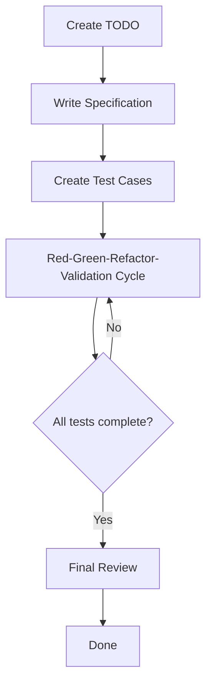
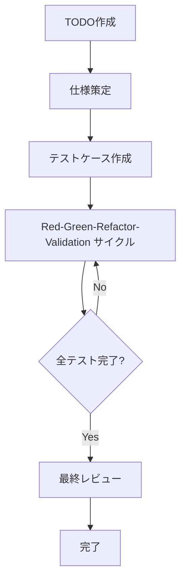

# 3.1 Overall Flow of the Extended TDD Process

## Overview of the AITDD Process

AITDD combines the power of AI with traditional TDD (Test-Driven Development) and adds a dedicated **Validation** step. By collaborating between humans and AI, you can efficiently develop high-quality software.

## Structure of the Overall Flow



### Basic Process Flow

```
Create TODO → Write specification → Create test cases → Red-Green-Refactor-Validation → Final review
```

## Details of Each Step

### 1. Create TODO (Human-driven)

**Purpose**: Clearly define development tasks and split them into appropriate work units

**Work items**:

- Identify functional requirements
- Break down development tasks
- Set priorities
- Clarify scope of work

**Deliverable**: TODO.md

- A list of concrete, implementable tasks
- Priorities and dependencies of each task
- Definition of completion conditions

### 2. Write Specification (Human-driven, review required)

**Purpose**: Develop detailed technical specifications from TODOs

**Work items**:

- Define detailed specifications of the feature
- Clarify inputs and outputs
- Establish error-handling policy
- Set performance requirements

**Important points**:

- **Human review is required**
- Consider AI suggestions, but humans make the final decisions
- Eliminate ambiguity in specifications

**Deliverable**: requirements.md

- Functional requirements
- Technical constraints
- Quality requirements

### 3. Create Test Cases (Human-driven, review required)

**Purpose**: Design comprehensive test cases based on the specification

**Work items**:

- Design normal-case test scenarios
- Design error-case test scenarios
- Plan boundary-value tests
- Identify edge cases

**Important points**:

- **Human review is required**
- Ensure coverage
- Verify consistency with the specification

**Deliverable**: testcases.md

- List of test cases
- Details of expected behavior
- Definition of test data

### 4. Red-Green-Refactor-Validation Cycle (Primarily AI-driven)

We extend the traditional TDD cycle by adding a **Validation** step. This cycle is executed almost entirely by AI under human supervision.

#### Red (Failing tests)

- Implement the test cases
- Confirm expected failures
- Run tests and confirm failures

#### Green (Minimal implementation)

- Implement the minimal code to pass the tests
- Automatic code generation by AI
- Confirm test success

#### Refactor (Refactoring)

- Improve code quality
- Optimization by AI
- Improve readability and maintainability

#### Validation (Verification)

- Validate the soundness of the implementation
- Perform quality checks
- Confirm additional verification items

### 5. Final Review (Human-driven)

**Purpose**: Perform final confirmation of overall code quality and conformance to the specification

**Work items**:

- Detailed review of the source code
- Confirm consistency with the specification
- Security checks
- Performance verification

**Important points**:

- **Must be performed by a human**
- Final quality gate for AI-generated code
- The last checkpoint before production

## Division of Roles Between AI and Humans

### Areas handled by AI (Claude, etc.)

- **Execute the Red-Green-Refactor-Validation cycle**

  - Implement test cases
  - Generate production code
  - Perform refactoring
  - Assist quality verification

- **Code generation and optimization**

  - Implement efficient algorithms
  - Implement according to coding conventions
  - Automatically improve code

- **Automated test execution**
  - Run tests and verify results
  - Measure test coverage
  - Continuous quality checks

### Areas handled by humans

- **Strategic decisions**

  - Specification writing and review
  - Test case design and review
  - Architecture decisions

- **Quality management**

  - Final source code review
  - Confirm security requirements
  - Confirm alignment with business requirements

- **Creative work**
  - Decide problem-solving approaches
  - Design user experience
  - Decide on technology choices

## Comparison with Traditional TDD

| Item                    | Traditional TDD                       | AITDD                                    |
| ----------------------- | ------------------------------------- | ---------------------------------------- |
| **Cycle**               | Red-Green-Refactor                    | Red-Green-Refactor-**Validation**        |
| **Primary implementer** | Human                                 | **AI** (under human supervision)         |
| **Review**              | After implementation only             | **Specification, tests, and final code** |
| **Speed**               | Depends on human implementation speed | **Significantly faster with AI support** |
| **Quality management**  | Depends on developer skill            | **Multi-layer quality checks**           |
| **Learning cost**       | Need to learn TDD                     | **TDD + AI utilization skills**          |

## Benefits of the Process

### 1. Increased development speed

- Significant reduction in implementation time through automatic code generation by AI
- Automation of repetitive tasks
- Faster test execution and feedback

### 2. Improved quality

- Additional quality checks via the Validation step
- Dual-check system by humans and AI
- Consistent application of quality standards

### 3. Knowledge utilization

- Leverage latest technologies and best practices via AI
- Enable high-quality code generation by less-experienced developers
- Automatically apply domain knowledge

### 4. Continuous improvement

- Learning effects via AI feedback
- Continuous optimization of the process itself
- Skill improvement across the team

## Cautions and Risk Management

### 1. Avoid excessive reliance on AI

- Humans must make important decisions
- Do not blindly accept AI proposals
- Continuously deepen technical understanding

### 2. Strengthen quality management

- Perform reviews in multiple stages
- Combine automated and manual tests
- Ensure security requirements are verified

### 3. Process flexibility

- Adjust the process for each project
- Apply according to team skill level
- Continuously improve the process

## Next Steps

In Chapter 3, we will explain each step of this process in detail:

- [3.2 Create TODO and Write Specification](./02-todo-and-specification.md)
- [3.3 Create Test Cases](./03-test-case-creation.md)
- [3.4 Red-Green-Refactor-Validation Cycle](./04-rgr-validation-cycle.md)
- [3.5 Details of the Validation Step](./05-validation-details.md)

Learn concrete procedures and techniques in each step so that you can actually practice AITDD.

# 3.1 拡張 TDD プロセスの全体フロー

## AITDD プロセスの概要

AITDD は従来の TDD（Test-Driven Development）に AI の力を組み合わせ、**Validation**ステップを追加した拡張開発手法です。人間と AI が協力することで、高品質なソフトウェアを効率的に開発できます。

## 全体フローの構造



### 基本的なプロセスフロー

```
TODO作成 → 仕様策定 → テストケース作成 → Red-Green-Refactor-Validation → 最終レビュー
```

## 各ステップの詳細

### 1. TODO 作成（人間が担当）

**目的**: 開発タスクを明確に定義し、適切な作業単位に分割する

**作業内容**:

- 機能要件の洗い出し
- 開発タスクの細分化
- 優先順位の設定
- 作業範囲の明確化

**成果物**: TODO.md ファイル

- 具体的で実装可能な単位のタスクリスト
- 各タスクの優先度と依存関係
- 完了条件の定義

### 2. 仕様策定（人間が担当・レビュー必須）

**目的**: TODO から詳細な技術仕様を策定する

**作業内容**:

- 機能の詳細仕様の定義
- 入出力の明確化
- エラーハンドリングの方針策定
- パフォーマンス要件の設定

**重要ポイント**:

- **人間によるレビューが必須**
- AI の提案を参考にしつつ、最終判断は人間が行う
- 仕様の曖昧さを排除する

**成果物**: requirements.md ファイル

- 機能要件の詳細
- 技術的制約
- 品質要件

### 3. テストケース作成（人間が担当・レビュー必須）

**目的**: 仕様に基づいて包括的なテストケースを設計する

**作業内容**:

- 正常系テストケースの設計
- 異常系テストケースの設計
- 境界値テストの計画
- エッジケースの特定

**重要ポイント**:

- **人間によるレビューが必須**
- テストケースの網羅性を確保
- 仕様との整合性を検証

**成果物**: testcases.md ファイル

- テストケースの一覧
- 期待する動作の詳細
- テストデータの定義

### 4. Red-Green-Refactor-Validation サイクル（主に AI が担当）

従来の TDD サイクルを拡張し、**Validation**ステップを追加しました。このサイクルはほぼ全て AI が実行しますが、人間の監督下で行われます。

#### Red（テスト失敗）

- テストケースの実装
- 期待する失敗の確認
- テストの実行と失敗確認

#### Green（最小実装）

- テストを通す最小限の実装
- AI による自動コード生成
- テスト成功の確認

#### Refactor（リファクタリング）

- コード品質の改善
- AI による最適化
- 可読性とメンテナンス性の向上

#### Validation（検証）

- 実装の妥当性検証
- 品質チェック
- 追加的な検証項目の確認

### 5. 最終レビュー（人間が担当）

**目的**: 生成されたコード全体の品質と仕様適合性を最終確認する

**作業内容**:

- ソースコードの詳細レビュー
- 仕様との整合性確認
- セキュリティチェック
- パフォーマンス検証

**重要ポイント**:

- **必ず人間が実施**
- AI が生成したコードの最終品質保証
- プロダクション投入前の最後の砦

## AI と人間の役割分担

### AI（Claude 等）が担当する領域

- **Red-Green-Refactor-Validation サイクルの実行**

  - テストケースの実装
  - プロダクションコードの生成
  - リファクタリングの実行
  - 品質検証の支援

- **コード生成と最適化**

  - 効率的なアルゴリズムの実装
  - コーディング規約に従った実装
  - 自動的なコード改善

- **自動テスト実行**
  - テストの実行と結果確認
  - テストカバレッジの計測
  - 継続的な品質チェック

### 人間が担当する領域

- **戦略的判断**

  - 仕様策定とレビュー
  - テストケース設計とレビュー
  - アーキテクチャ決定

- **品質管理**

  - 最終的なソースコードレビュー
  - セキュリティ要件の確認
  - ビジネス要件との適合性確認

- **創造的作業**
  - 問題解決のアプローチ決定
  - ユーザー体験の設計
  - 技術選択の判断

## 従来 TDD との比較

| 項目           | 従来 TDD             | AITDD                             |
| -------------- | -------------------- | --------------------------------- |
| **サイクル**   | Red-Green-Refactor   | Red-Green-Refactor-**Validation** |
| **実装主体**   | 人間                 | **AI**（人間監督下）              |
| **レビュー**   | 実装後のみ           | **仕様・テスト・最終コード**      |
| **速度**       | 人間の実装速度に依存 | **AI 支援により大幅に高速化**     |
| **品質管理**   | 開発者のスキルに依存 | **多層的な品質チェック**          |
| **学習コスト** | TDD の習得が必要     | **TDD + AI 活用スキル**           |

## プロセスの利点

### 1. 開発速度の向上

- AI による自動コード生成により実装時間を大幅短縮
- 反復的なタスクの自動化
- テスト実行とフィードバックの高速化

### 2. 品質の向上

- Validation ステップによる追加的な品質チェック
- 人間と AI の二重チェック体制
- 一貫した品質基準の適用

### 3. 知識の活用

- AI による最新技術やベストプラクティスの活用
- 経験の浅い開発者でも高品質なコード生成
- ドメイン知識の自動的な活用

### 4. 継続的改善

- AI のフィードバックによる学習効果
- プロセス自体の継続的最適化
- チーム全体のスキル向上

## 注意点とリスク管理

### 1. 過度な AI 依存の回避

- 重要な判断は必ず人間が行う
- AI の提案を盲目的に受け入れない
- 技術的理解を継続的に深める

### 2. 品質管理の強化

- 複数段階でのレビュー実施
- 自動テストとマニュアルテストの併用
- セキュリティ要件の確実な確認

### 3. プロセスの柔軟性

- プロジェクトに応じたプロセス調整
- チームのスキルレベルに応じた適用
- 継続的なプロセス改善

## 次のステップ

第 3 章では、このプロセスの各ステップを詳細に解説していきます：

- [3.2 TODO 作成と仕様策定](./02-todo-and-specification.md)
- [3.3 テストケース作成](./03-test-case-creation.md)
- [3.4 Red-Green-Refactor-Validation サイクル](./04-rgr-validation-cycle.md)
- [3.5 Validation ステップの詳細](./05-validation-details.md)

各ステップで具体的な手順とテクニックを学び、実際に AITDD を実践できるようになりましょう。
