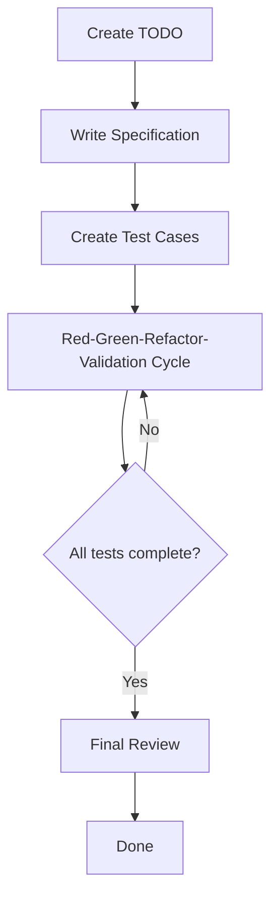
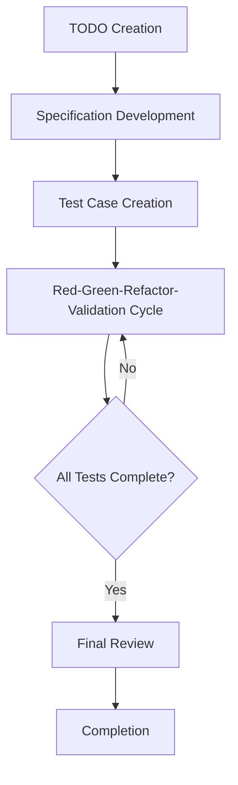

# 3.1 Overall Flow of the Extended TDD Process

## Overview of the AITDD Process

AITDD combines the power of AI with traditional TDD (Test-Driven Development) and adds a dedicated **Validation** step. By collaborating between humans and AI, you can efficiently develop high-quality software.

## Structure of the Overall Flow



### Basic Process Flow

```
Create TODO → Write specification → Create test cases → Red-Green-Refactor-Validation → Final review
```

## Details of Each Step

### 1. Create TODO (Human-driven)

**Purpose**: Clearly define development tasks and split them into appropriate work units

**Work items**:

- Identify functional requirements
- Break down development tasks
- Set priorities
- Clarify scope of work

**Deliverable**: TODO.md

- A list of concrete, implementable tasks
- Priorities and dependencies of each task
- Definition of completion conditions

### 2. Write Specification (Human-driven, review required)

**Purpose**: Develop detailed technical specifications from TODOs

**Work items**:

- Define detailed specifications of the feature
- Clarify inputs and outputs
- Establish error-handling policy
- Set performance requirements

**Important points**:

- **Human review is required**
- Consider AI suggestions, but humans make the final decisions
- Eliminate ambiguity in specifications

**Deliverable**: requirements.md

- Functional requirements
- Technical constraints
- Quality requirements

### 3. Create Test Cases (Human-driven, review required)

**Purpose**: Design comprehensive test cases based on the specification

**Work items**:

- Design normal-case test scenarios
- Design error-case test scenarios
- Plan boundary-value tests
- Identify edge cases

**Important points**:

- **Human review is required**
- Ensure coverage
- Verify consistency with the specification

**Deliverable**: testcases.md

- List of test cases
- Details of expected behavior
- Definition of test data

### 4. Red-Green-Refactor-Validation Cycle (Primarily AI-driven)

We extend the traditional TDD cycle by adding a **Validation** step. This cycle is executed almost entirely by AI under human supervision.

#### Red (Failing tests)

- Implement the test cases
- Confirm expected failures
- Run tests and confirm failures

#### Green (Minimal implementation)

- Implement the minimal code to pass the tests
- Automatic code generation by AI
- Confirm test success

#### Refactor (Refactoring)

- Improve code quality
- Optimization by AI
- Improve readability and maintainability

#### Validation (Verification)

- Validate the soundness of the implementation
- Perform quality checks
- Confirm additional verification items

### 5. Final Review (Human-driven)

**Purpose**: Perform final confirmation of overall code quality and conformance to the specification

**Work items**:

- Detailed review of the source code
- Confirm consistency with the specification
- Security checks
- Performance verification

**Important points**:

- **Must be performed by a human**
- Final quality gate for AI-generated code
- The last checkpoint before production

## Division of Roles Between AI and Humans

### Areas handled by AI (Claude, etc.)

- **Execute the Red-Green-Refactor-Validation cycle**

  - Implement test cases
  - Generate production code
  - Perform refactoring
  - Assist quality verification

- **Code generation and optimization**

  - Implement efficient algorithms
  - Implement according to coding conventions
  - Automatically improve code

- **Automated test execution**
  - Run tests and verify results
  - Measure test coverage
  - Continuous quality checks

### Areas handled by humans

- **Strategic decisions**

  - Specification writing and review
  - Test case design and review
  - Architecture decisions

- **Quality management**

  - Final source code review
  - Confirm security requirements
  - Confirm alignment with business requirements

- **Creative work**
  - Decide problem-solving approaches
  - Design user experience
  - Decide on technology choices

## Comparison with Traditional TDD

| Item                    | Traditional TDD                       | AITDD                                    |
| ----------------------- | ------------------------------------- | ---------------------------------------- |
| **Cycle**               | Red-Green-Refactor                    | Red-Green-Refactor-**Validation**        |
| **Primary implementer** | Human                                 | **AI** (under human supervision)         |
| **Review**              | After implementation only             | **Specification, tests, and final code** |
| **Speed**               | Depends on human implementation speed | **Significantly faster with AI support** |
| **Quality management**  | Depends on developer skill            | **Multi-layer quality checks**           |
| **Learning cost**       | Need to learn TDD                     | **TDD + AI utilization skills**          |

## Benefits of the Process

### 1. Increased development speed

- Significant reduction in implementation time through automatic code generation by AI
- Automation of repetitive tasks
- Faster test execution and feedback

### 2. Improved quality

- Additional quality checks via the Validation step
- Dual-check system by humans and AI
- Consistent application of quality standards

### 3. Knowledge utilization

- Leverage latest technologies and best practices via AI
- Enable high-quality code generation by less-experienced developers
- Automatically apply domain knowledge

### 4. Continuous improvement

- Learning effects via AI feedback
- Continuous optimization of the process itself
- Skill improvement across the team

## Cautions and Risk Management

### 1. Avoid excessive reliance on AI

- Humans must make important decisions
- Do not blindly accept AI proposals
- Continuously deepen technical understanding

### 2. Strengthen quality management

- Perform reviews in multiple stages
- Combine automated and manual tests
- Ensure security requirements are verified

### 3. Process flexibility

- Adjust the process for each project
- Apply according to team skill level
- Continuously improve the process

## Next Steps

In Chapter 3, we will explain each step of this process in detail:

- [3.2 Create TODO and Write Specification](./02-todo-and-specification.md)
- [3.3 Create Test Cases](./03-test-case-creation.md)
- [3.4 Red-Green-Refactor-Validation Cycle](./04-rgr-validation-cycle.md)
- [3.5 Details of the Validation Step](./05-validation-details.md)

Learn concrete procedures and techniques in each step so that you can actually practice AITDD.

# 3.1 Extended TDD Process Overall Flow

## AITDD Process Overview

AITDD is an extended development methodology that combines AI power with traditional TDD (Test-Driven Development) and adds a **Validation** step. Through human-AI collaboration, we can efficiently develop high-quality software.

## Overall Flow Structure



### Basic Process Flow

```
TODO Creation → Specification Development → Test Case Creation → Red-Green-Refactor-Validation → Final Review
```

## Details of Each Step

### 1. TODO Creation (Human Responsibility)

**Purpose**: Clearly define development tasks and divide them into appropriate work units

**Work Content**:

- Identify functional requirements
- Break down development tasks
- Set priorities
- Clarify work scope

**Deliverables**: TODO.md file

- Task list in concrete, implementable units
- Priority and dependencies for each task
- Definition of completion criteria

### 2. Specification Development (Human Responsibility - Review Required)

**Purpose**: Develop detailed technical specifications from TODOs

**Work Content**:

- Define detailed functional specifications
- Clarify inputs and outputs
- Establish error handling policies
- Set performance requirements

**Important Points**:

- **Human review is mandatory**
- Use AI suggestions as reference, but humans make final decisions
- Eliminate specification ambiguity

**Deliverables**: requirements.md file

- Detailed functional requirements
- Technical constraints
- Quality requirements

### 3. Test Case Creation (Human Responsibility - Review Required)

**Purpose**: Design comprehensive test cases based on specifications

**Work Content**:

- Design normal case test cases
- Design abnormal case test cases
- Plan boundary value tests
- Identify edge cases

**Important Points**:

- **Human review is mandatory**
- Ensure test case comprehensiveness
- Verify consistency with specifications

**Deliverables**: testcases.md file

- Test case list
- Detailed expected behavior
- Test data definitions

### 4. Red-Green-Refactor-Validation Cycle (Primarily AI Responsibility)

We extended the traditional TDD cycle by adding a **Validation** step. This cycle is almost entirely executed by AI but conducted under human supervision.

#### Red (Test Failure)

- Implement the test cases
- Confirm expected failures
- Run tests and confirm failures

#### Green (Minimal implementation)

- Implement the minimal code to pass the tests
- Automatic code generation by AI
- Confirm test success

#### Refactor (Refactoring)

- Improve code quality
- Optimization by AI
- Improve readability and maintainability

#### Validation (Verification)

- Validate the soundness of the implementation
- Perform quality checks
- Confirm additional verification items

### 5. Final Review (Human-driven)

**Purpose**: Perform final confirmation of overall code quality and conformance to the specification

**Work items**:

- Detailed review of the source code
- Confirm consistency with the specification
- Security checks
- Performance verification

**Important points**:

- **Must be performed by a human**
- Final quality gate for AI-generated code
- The last checkpoint before production

## AI and Human Role Division

### Areas handled by AI (Claude, etc.)

- **Execute the Red-Green-Refactor-Validation cycle**

  - Implement test cases
  - Generate production code
  - Perform refactoring
  - Assist quality verification

- **Code generation and optimization**

  - Implement efficient algorithms
  - Implement according to coding conventions
  - Automatically improve code

- **Automated test execution**
  - Run tests and verify results
  - Measure test coverage
  - Continuous quality checks

### Areas handled by humans

- **Strategic decisions**

  - Specification writing and review
  - Test case design and review
  - Architecture decisions

- **Quality management**

  - Final source code review
  - Confirm security requirements
  - Confirm alignment with business requirements

- **Creative work**
  - Decide problem-solving approaches
  - Design user experience
  - Decide on technology choices

## Comparison with Traditional TDD

| Item                    | Traditional TDD                       | AITDD                                       |
| ----------------------- | ------------------------------------- | ------------------------------------------- |
| **Cycle**               | Red-Green-Refactor                    | Red-Green-Refactor-**Validation**           |
| **Primary implementer** | Human                                 | **AI** (under human supervision)            |
| **Review**              | After implementation only             | **Specifications, tests, and final code**   |
| **Speed**               | Depends on human implementation speed | **Significantly faster with AI assistance** |
| **Quality management**  | Depends on developer skill            | **Multi-layered quality checks**            |
| **Learning cost**       | Need to learn TDD                     | **TDD + AI utilization skills**             |

## Process Benefits

### 1. Increased development speed

- Significant reduction in implementation time through automatic code generation by AI
- Automation of repetitive tasks
- Faster test execution and feedback

### 2. Improved quality

- Additional quality checks via the Validation step
- Dual-check system by humans and AI
- Consistent application of quality standards

### 3. Knowledge utilization

- Leverage latest technologies and best practices via AI
- Enable high-quality code generation by less-experienced developers
- Automatically apply domain knowledge

### 4. Continuous improvement

- Learning effects via AI feedback
- Continuous optimization of the process itself
- Skill improvement across the team

## Cautions and Risk Management

### 1. Avoid excessive reliance on AI

- Humans must make important decisions
- Do not blindly accept AI proposals
- Continuously deepen technical understanding

### 2. Strengthen quality management

- Perform reviews in multiple stages
- Combine automated and manual tests
- Ensure security requirements are verified

### 3. Process flexibility

- Adjust the process for each project
- Apply according to team skill level
- Continuously improve the process

## Next Steps

Chapter 3 will explain each step of this process in detail:

- [3.2 TODO Creation and Specification Development](./02-todo-and-specification.md)
- [3.3 Test Case Creation](./03-test-case-creation.md)
- [3.4 Red-Green-Refactor-Validation Cycle](./04-rgr-validation-cycle.md)
- [3.5 Validation Step Details](./05-validation-details.md)

Learn concrete procedures and techniques in each step so that you can actually practice AITDD.
