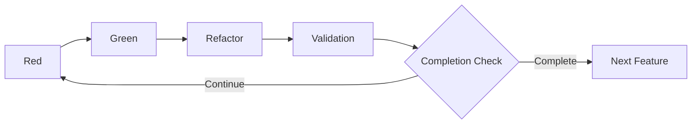
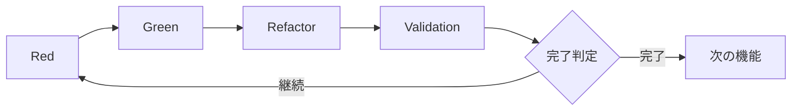

# 3.4 Red-Green-Refactor-Validation Cycle

## Overview of the Extended TDD Cycle

At the heart of AITDD is an extended cycle that adds a **Validation** step to traditional TDD (Red-Green-Refactor). This cycle is primarily executed by AI under human supervision, enabling efficient generation of high-quality code.



## Details of the Red-Green-Refactor-Validation Cycle

### Red Phase: Confirm Failing Tests

#### Purpose

- Implement test cases
- Confirm that tests fail as expected
- Validate correctness of the tests themselves

#### Concrete work items

##### 1. Implement test cases

```javascript
// Example: Implementing tests for User Registration
describe("User Registration", () => {
  test("should create user with valid data", async () => {
    const userData = {
      email: "test@example.com",
      password: "SecurePass123!",
      password_confirmation: "SecurePass123!",
    };

    const response = await request(app).post("/api/users").send(userData);

    expect(response.status).toBe(201);
    expect(response.body).toHaveProperty("id");
    expect(response.body.email).toBe(userData.email);

    // Confirm the database
    const user = await User.findByEmail(userData.email);
    expect(user).toBeTruthy();
    expect(user.password_hash).not.toBe(userData.password);
  });

  test("should reject duplicate email", async () => {
    // Create an existing user in advance
    await createUser({ email: "existing@example.com" });

    const duplicateData = {
      email: "existing@example.com",
      password: "NewPass456!",
    };

    const response = await request(app).post("/api/users").send(duplicateData);

    expect(response.status).toBe(400);
    expect(response.body.error).toBe("validation_failed");
    expect(response.body.details[0].field).toBe("email");
  });
});
```

##### 2. Run tests and confirm failures

```bash
$ npm test
❌ User Registration › should create user with valid data
   Error: Cannot POST /api/users

❌ User Registration › should reject duplicate email
   Error: Cannot POST /api/users
```

##### 3. Identify failure reasons

- Endpoint not implemented
- Missing dependencies
- Test environment misconfiguration

#### Running the Red phase with AI

##### Example prompt

```markdown
## Instruction: Run the Red phase

### Background

- Feature: User registration API
- Test case specification: See testcases.md
- Existing code: Check under src/

### Tasks

1. Implement each test case in testcases.md as Jest tests
2. Run the tests and confirm expected failures
3. Organize and report the reasons for failures

### Output format

- Full test code
- Test execution results
- Analysis of failure reasons
- Suggestions for the next Green phase
```

### Green Phase: Minimal Implementation

#### Purpose

- Implement the minimal code to pass the tests
- Avoid over-implementation and maintain test-driven flow
- Leave room for improvement in the Refactor phase

#### Concrete work items

##### 1. Minimal API implementation

```javascript
// routes/users.js
const express = require("express");
const bcrypt = require("bcrypt");
const User = require("../models/User");
const router = express.Router();

router.post("/users", async (req, res) => {
  try {
    const { email, password, password_confirmation } = req.body;

    // Basic validation
    if (!email || !password || !password_confirmation) {
      return res.status(400).json({
        error: "validation_failed",
        details: [{ field: "required", message: "Missing required fields" }],
      });
    }

    if (password !== password_confirmation) {
      return res.status(400).json({
        error: "validation_failed",
        details: [
          {
            field: "password",
            message: "Password confirmation does not match",
          },
        ],
      });
    }

    // Duplicate check
    const existingUser = await User.findByEmail(email);
    if (existingUser) {
      return res.status(400).json({
        error: "validation_failed",
        details: [{ field: "email", message: "Email already exists" }],
      });
    }

    // Hash password
    const password_hash = await bcrypt.hash(password, 10);

    // Create user
    const user = await User.create({
      email,
      password_hash,
    });

    res.status(201).json({
      id: user.id,
      email: user.email,
      created_at: user.created_at,
    });
  } catch (error) {
    console.error("User creation error:", error);
    res.status(500).json({ error: "Internal server error" });
  }
});

module.exports = router;
```

##### 2. Minimal model implementation

```javascript
// models/User.js
const db = require("../database");

class User {
  static async findByEmail(email) {
    const result = await db.query("SELECT * FROM users WHERE email = ?", [
      email,
    ]);
    return result[0] || null;
  }

  static async create({ email, password_hash }) {
    const result = await db.query(
      "INSERT INTO users (email, password_hash, created_at) VALUES (?, ?, NOW())",
      [email, password_hash]
    );

    return {
      id: result.insertId,
      email,
      created_at: new Date(),
    };
  }
}

module.exports = User;
```

##### 3. Run tests and confirm success

```bash
$ npm test
✅ User Registration › should create user with valid data
✅ User Registration › should reject duplicate email

Tests: 2 passed, 2 total
```

#### Running the Green phase with AI

##### Example prompt

```markdown
## Instruction: Run the Green phase

### Background

- Failing tests: [Results from the Red phase]
- Requirements: See requirements.md
- Existing code structure: Check under src/

### Tasks

1. Implement the minimal code to pass failing tests
2. Avoid over-implementation beyond the test cases
3. Run tests and confirm success for all cases

### Constraints

- Adhere to the principle of minimal implementation
- Do not implement features outside test cases
- Maintain consistency with existing code

### Output format

- Full implementation code
- Test execution results
- Explanation of implementation policy
```

### Refactor Phase: Improve Code

#### Purpose

- Improve code quality
- Enhance maintainability and readability
- Optimize performance
- Keep all tests passing

#### Concrete work items

##### 1. Improve code structure

```javascript
// services/UserService.js - Separate business logic
class UserService {
  constructor(userRepository, passwordHasher) {
    this.userRepository = userRepository;
    this.passwordHasher = passwordHasher;
  }

  async createUser({ email, password, password_confirmation }) {
    // Validation
    this.validateUserInput({ email, password, password_confirmation });

    // Duplicate check
    await this.checkEmailUniqueness(email);

    // Create user
    const password_hash = await this.passwordHasher.hash(password);
    return await this.userRepository.create({ email, password_hash });
  }

  validateUserInput({ email, password, password_confirmation }) {
    const errors = [];

    if (!this.isValidEmail(email)) {
      errors.push({ field: "email", message: "Invalid email format" });
    }

    if (!this.isValidPassword(password)) {
      errors.push({
        field: "password",
        message: "Password does not meet requirements",
      });
    }

    if (password !== password_confirmation) {
      errors.push({
        field: "password_confirmation",
        message: "Password confirmation does not match",
      });
    }

    if (errors.length > 0) {
      throw new ValidationError(errors);
    }
  }

  async checkEmailUniqueness(email) {
    const existingUser = await this.userRepository.findByEmail(email);
    if (existingUser) {
      throw new ValidationError([
        { field: "email", message: "Email already exists" },
      ]);
    }
  }

  isValidEmail(email) {
    const emailRegex = /^[^\s@]+@[^\s@]+\.[^\s@]+$/;
    return email && email.length <= 254 && emailRegex.test(email);
  }

  isValidPassword(password) {
    if (!password || password.length < 8) return false;

    const hasUpperCase = /[A-Z]/.test(password);
    const hasLowerCase = /[a-z]/.test(password);
    const hasNumbers = /\d/.test(password);
    const hasSymbols = /[!@#$%^&*()_+\-=\[\]{};':"\\|,.<>\/?]/.test(password);

    return hasUpperCase && hasLowerCase && hasNumbers && hasSymbols;
  }
}

// Simplify controller
router.post("/users", async (req, res) => {
  try {
    const user = await userService.createUser(req.body);
    res.status(201).json({
      id: user.id,
      email: user.email,
      created_at: user.created_at,
    });
  } catch (error) {
    if (error instanceof ValidationError) {
      return res.status(400).json({
        error: "validation_failed",
        details: error.details,
      });
    }

    console.error("User creation error:", error);
    res.status(500).json({ error: "Internal server error" });
  }
});
```

##### 2. Improve error handling

```javascript
// errors/ValidationError.js
class ValidationError extends Error {
  constructor(details) {
    super("Validation failed");
    this.name = "ValidationError";
    this.details = details;
  }
}

// middlewares/errorHandler.js
const errorHandler = (error, req, res, next) => {
  if (error instanceof ValidationError) {
    return res.status(400).json({
      error: "validation_failed",
      details: error.details,
    });
  }

  console.error("Unhandled error:", error);
  res.status(500).json({ error: "Internal server error" });
};
```

##### 3. Run tests to confirm quality remains

```bash
$ npm test
✅ User Registration › should create user with valid data
✅ User Registration › should reject duplicate email
✅ User Registration › should validate email format
✅ User Registration › should validate password strength

Tests: 4 passed, 4 total
```

#### Running the Refactor phase with AI

##### Example prompt

```markdown
## Instruction: Run the Refactor phase

### Background

- Current code: [Results of the Green phase]
- Test status: All tests passing
- Quality goals: Maintainability, readability, performance

### Tasks

1. Improve code structure (separation of concerns, DRY)
2. Standardize error handling
3. Optimize performance
4. Apply coding standards
5. Confirm quality by running tests

### Constraints

- Do not break existing tests
- Avoid excessive architectural changes
- Emphasize incremental improvements

### Output format

- Refactored code
- Explanation of improvements
- Test execution results
```

### Validation Phase: Comprehensive Verification

#### Purpose

- Comprehensively verify implementation validity
- Check conformance to quality standards
- Evaluate whether additional test cases are necessary
- Make completion decision

#### Concrete verification items

##### 1. Confirm implementation status of test cases

```markdown
## Confirm status of test-case implementation

### Planned test cases (from testcases.md)

- [x] TC001: Successful user registration
- [x] TC002: Duplicate email error
- [x] TC003: Password mismatch error
- [x] TC004: Invalid email format
- [x] TC005: Insufficient password strength
- [x] TC006: Missing required fields
- [x] TC007: Boundary test – email length
- [ ] TC008: Rate limiting test (not implemented)
- [ ] TC009: Database connection error (not implemented)
- [x] TC010: CSRF token verification

### Implementation rate: 80% (8/10)
```

##### 2. Confirm regression of existing tests

```bash
$ npm test
✅ User Authentication › should login with valid credentials
✅ User Authentication › should reject invalid password
✅ User Registration › should create user with valid data
✅ User Registration › should reject duplicate email
✅ Product Management › should create product
✅ Product Management › should list products

Tests: 6 passed, 6 total
Time: 2.341s
```

##### 3. Confirm code-quality metrics

```bash
$ npm run quality-check
✅ ESLint: 0 errors, 0 warnings
✅ Test Coverage: 95% statements, 92% branches
✅ Code Complexity: Average 3.2 (Good)
✅ Dependency Check: No vulnerabilities found
```

##### 4. Confirm conformance to specification

```markdown
## Specification conformance check

### Functional requirements

- [x] New user registration via email/password
- [x] Duplicate email validation
- [x] Password strength check
- [x] Password hashing (bcrypt)

### Non-functional requirements

- [x] Response time: average 1.2s (≤ 2s)
- [ ] Concurrent registration: Load test not yet performed
- [x] Password hashing is required

### API specifications

- [x] POST /api/users endpoint
- [x] Expected request/response format
- [x] Appropriate HTTP status codes

### Database design

- [x] users table design
- [x] Appropriate indexes
- [x] Implement constraints
```

##### 5. Confirm security requirements

```markdown
## Security check

### Password management

- [x] No plaintext password storage
- [x] Hashing with bcrypt
- [x] Appropriate salt usage

### Input validation

- [x] SQL injection countermeasures
- [x] XSS countermeasures
- [x] CSRF token verification

### Access control

- [x] Appropriate HTTP status codes
- [x] Appropriate limitation of error information
```

#### Running the Validation phase with AI

##### Example prompt

```markdown
## Instruction: Run the Validation phase

### Background

- Completed implementation: [Results of the Refactor phase]
- Requirements: requirements.md
- Test cases: testcases.md
- Existing system: Entire codebase

### Verification items

1. Confirm implementation status of all test cases listed in testcases.md
2. Run regression tests of existing tests
3. Confirm fulfillment of requirements in requirements.md
4. Measure code-quality metrics
5. Confirm security requirements

### Completion criteria

- 90% or higher implementation rate for planned test cases
- All existing tests pass
- 100% fulfillment of important requirements
- No critical security issues

### Output format

- Verification report
- List of unimplemented test cases
- Quality metrics
- Reasons for completion/continuation decision
```

#### Decision Criteria for the Validation Phase

##### ✅ Complete (proceed automatically)

```markdown
### Completion criteria

- Status of existing tests: All pass
- Implementation rate for test cases: ≥ 90%
- Fulfillment rate of important requirements: 100%
- Code coverage: ≥ 80%
- Security check: No critical issues
```

##### ⚠️ Continue (additional implementation needed)

```markdown
### Continuation criteria

- Existing tests: Failures present
- Test-case implementation rate: < 90%
- Important requirements: Not fully satisfied
- Quality metrics: Below threshold
- Security: Critical issues found
```

## Managing the Entire Cycle

### Process control

#### 1. Automate cycle execution

```markdown
## Example AITDD execution script

### Inputs

- requirements.md
- testcases.md
- Existing codebase

### Execution flow

1. Red: Implement and run test cases
2. Green: Minimal implementation
3. Refactor: Improve code
4. Validation: Comprehensive verification
5. Decision: Automatic completion/continuation

### Outputs

- Implementation code
- Test results
- Quality report
- Recommendations for next steps
```

#### 2. Visualize progress

```markdown
## Progress tracking

### Test-case progress

- Implemented: 8/10 (80%)
- Passed: 8/8 (100%)
- Failed: 0/8 (0%)

### Quality metrics

- Coverage: 95%
- Complexity: 3.2 (Good)
- Duplication: 2% (Good)

### Requirement fulfillment

- Functional requirements: 100%
- Non-functional requirements: 80%
- Security requirements: 100%
```

### Points of Human Intervention

#### 1. When important decisions are needed

- Major architectural changes
- Interpretation of security requirements
- Adjustment of performance requirements
- Complex decisions in business logic

#### 2. Adjust quality standards

- Target for test coverage
- Acceptable code complexity
- Review performance requirements

#### 3. Optimize the process

- Improve cycle execution time
- Increase precision of AI instructions
- Expand scope of automation

## Error Handling and Debugging

### Common problems and countermeasures

#### 1. Tests do not fail correctly in the Red phase

**Cause**: Mistakes implementing test cases, environment configuration issues  
**Countermeasure**: Re-check test-case specifications, re-initialize the environment

#### 2. Over-implementation in the Green phase

**Cause**: Lack of understanding of the minimal implementation principle  
**Countermeasure**: Adhere strictly to test-driven development, clarify implementation scope

#### 3. Tests break in the Refactor phase

**Cause**: Logical changes during refactoring  
**Countermeasure**: Refactor incrementally, run tests continuously

#### 4. Thresholds not met in the Validation phase

**Cause**: Insufficient understanding of requirements, misconfigured quality standards  
**Countermeasure**: Reconfirm requirements, adjust thresholds

## Next Steps

Once you understand the Red-Green-Refactor-Validation cycle, proceed to [Details of the Validation Step](./05-validation-details.md) to learn deeper quality-management techniques.

### Learning points

- [ ] Understood purposes and tasks of each phase
- [ ] Grasped division of roles between AI and humans
- [ ] Mastered quality management across the entire cycle
- [ ] Learned basic error-handling patterns

By mastering this cycle, you will be able to efficiently develop high-quality software while making maximum use of AI.

# 3.4 Red-Green-Refactor-Validation サイクル

## 拡張 TDD サイクルの概要

AITDD の核心は、従来の TDD（Red-Green-Refactor）に**Validation**ステップを追加した拡張サイクルです。このサイクルは主に AI が実行しますが、人間の監督下で行われ、高品質なコードを効率的に生成します。



## Red-Green-Refactor-Validation サイクル詳細

### Red フェーズ：テスト失敗の確認

#### 目的

- テストケースを実装する
- テストが期待通りに失敗することを確認する
- テスト自体の正当性を検証する

#### 具体的な作業内容

##### 1. テストケースの実装

```javascript
// 例：ユーザー登録機能のテスト実装
describe("User Registration", () => {
  test("should create user with valid data", async () => {
    const userData = {
      email: "test@example.com",
      password: "SecurePass123!",
      password_confirmation: "SecurePass123!",
    };

    const response = await request(app).post("/api/users").send(userData);

    expect(response.status).toBe(201);
    expect(response.body).toHaveProperty("id");
    expect(response.body.email).toBe(userData.email);

    // データベース確認
    const user = await User.findByEmail(userData.email);
    expect(user).toBeTruthy();
    expect(user.password_hash).not.toBe(userData.password);
  });

  test("should reject duplicate email", async () => {
    // 既存ユーザーを事前作成
    await createUser({ email: "existing@example.com" });

    const duplicateData = {
      email: "existing@example.com",
      password: "NewPass456!",
    };

    const response = await request(app).post("/api/users").send(duplicateData);

    expect(response.status).toBe(400);
    expect(response.body.error).toBe("validation_failed");
    expect(response.body.details[0].field).toBe("email");
  });
});
```

##### 2. テスト実行と失敗確認

```bash
$ npm test
❌ User Registration › should create user with valid data
   Error: Cannot POST /api/users

❌ User Registration › should reject duplicate email
   Error: Cannot POST /api/users
```

##### 3. 失敗理由の確認

- エンドポイントが未実装
- 必要な依存関係が不足
- テスト環境の設定不備

#### AI による Red フェーズの実行

##### プロンプト例

```markdown
## 指示：Red フェーズの実行

### 背景

- 機能：ユーザー登録 API
- テストケース仕様：testcases.md 参照
- 既存コード：src/配下を確認

### 実行内容

1. testcases.md の各テストケースを Jest テストとして実装
2. テストを実行し、期待通りに失敗することを確認
3. 失敗理由を整理して報告

### 出力形式

- テストコード（完全版）
- テスト実行結果
- 失敗理由の分析
- 次の Green フェーズへの提案
```

### Green フェーズ：最小実装

#### 目的

- テストを通す最小限の実装を行う
- 過度な実装を避け、テスト駆動を維持する
- 次の Refactor フェーズでの改善余地を残す

#### 具体的な作業内容

##### 1. 最小限の API 実装

```javascript
// routes/users.js
const express = require("express");
const bcrypt = require("bcrypt");
const User = require("../models/User");
const router = express.Router();

router.post("/users", async (req, res) => {
  try {
    const { email, password, password_confirmation } = req.body;

    // 基本バリデーション
    if (!email || !password || !password_confirmation) {
      return res.status(400).json({
        error: "validation_failed",
        details: [{ field: "required", message: "Missing required fields" }],
      });
    }

    if (password !== password_confirmation) {
      return res.status(400).json({
        error: "validation_failed",
        details: [
          {
            field: "password",
            message: "Password confirmation does not match",
          },
        ],
      });
    }

    // 重複チェック
    const existingUser = await User.findByEmail(email);
    if (existingUser) {
      return res.status(400).json({
        error: "validation_failed",
        details: [{ field: "email", message: "Email already exists" }],
      });
    }

    // パスワードハッシュ化
    const password_hash = await bcrypt.hash(password, 10);

    // ユーザー作成
    const user = await User.create({
      email,
      password_hash,
    });

    res.status(201).json({
      id: user.id,
      email: user.email,
      created_at: user.created_at,
    });
  } catch (error) {
    console.error("User creation error:", error);
    res.status(500).json({ error: "Internal server error" });
  }
});

module.exports = router;
```

##### 2. 必要最小限のモデル実装

```javascript
// models/User.js
const db = require("../database");

class User {
  static async findByEmail(email) {
    const result = await db.query("SELECT * FROM users WHERE email = ?", [
      email,
    ]);
    return result[0] || null;
  }

  static async create({ email, password_hash }) {
    const result = await db.query(
      "INSERT INTO users (email, password_hash, created_at) VALUES (?, ?, NOW())",
      [email, password_hash]
    );

    return {
      id: result.insertId,
      email,
      created_at: new Date(),
    };
  }
}

module.exports = User;
```

##### 3. テスト実行と成功確認

```bash
$ npm test
✅ User Registration › should create user with valid data
✅ User Registration › should reject duplicate email

Tests: 2 passed, 2 total
```

#### AI による Green フェーズの実行

##### プロンプト例

```markdown
## 指示：Green フェーズの実行

### 背景

- 失敗中のテスト：[Red フェーズの結果]
- 要件：requirements.md 参照
- 既存コード構造：src/配下確認

### 実行内容

1. 失敗テストを通す最小限の実装
2. 要件の過度な実装は避ける
3. テスト実行で全ケース成功を確認

### 制約

- 最小実装原則を遵守
- テストケース以外の機能は実装しない
- 既存コードとの整合性を維持

### 出力形式

- 実装コード（完全版）
- テスト実行結果
- 実装方針の説明
```

### Refactor フェーズ：コード改善

#### 目的

- コードの品質を向上させる
- 保守性と可読性を改善する
- パフォーマンスを最適化する
- テストは継続して成功させる

#### 具体的な作業内容

##### 1. コード構造の改善

```javascript
// services/UserService.js - ビジネスロジックの分離
class UserService {
  constructor(userRepository, passwordHasher) {
    this.userRepository = userRepository;
    this.passwordHasher = passwordHasher;
  }

  async createUser({ email, password, password_confirmation }) {
    // バリデーション
    this.validateUserInput({ email, password, password_confirmation });

    // 重複チェック
    await this.checkEmailUniqueness(email);

    // ユーザー作成
    const password_hash = await this.passwordHasher.hash(password);
    return await this.userRepository.create({ email, password_hash });
  }

  validateUserInput({ email, password, password_confirmation }) {
    const errors = [];

    if (!this.isValidEmail(email)) {
      errors.push({ field: "email", message: "Invalid email format" });
    }

    if (!this.isValidPassword(password)) {
      errors.push({
        field: "password",
        message: "Password does not meet requirements",
      });
    }

    if (password !== password_confirmation) {
      errors.push({
        field: "password_confirmation",
        message: "Password confirmation does not match",
      });
    }

    if (errors.length > 0) {
      throw new ValidationError(errors);
    }
  }

  async checkEmailUniqueness(email) {
    const existingUser = await this.userRepository.findByEmail(email);
    if (existingUser) {
      throw new ValidationError([
        { field: "email", message: "Email already exists" },
      ]);
    }
  }

  isValidEmail(email) {
    const emailRegex = /^[^\s@]+@[^\s@]+\.[^\s@]+$/;
    return email && email.length <= 254 && emailRegex.test(email);
  }

  isValidPassword(password) {
    if (!password || password.length < 8) return false;

    const hasUpperCase = /[A-Z]/.test(password);
    const hasLowerCase = /[a-z]/.test(password);
    const hasNumbers = /\d/.test(password);
    const hasSymbols = /[!@#$%^&*()_+\-=\[\]{};':"\\|,.<>\/?]/.test(password);

    return hasUpperCase && hasLowerCase && hasNumbers && hasSymbols;
  }
}

// コントローラーの簡素化
router.post("/users", async (req, res) => {
  try {
    const user = await userService.createUser(req.body);
    res.status(201).json({
      id: user.id,
      email: user.email,
      created_at: user.created_at,
    });
  } catch (error) {
    if (error instanceof ValidationError) {
      return res.status(400).json({
        error: "validation_failed",
        details: error.details,
      });
    }

    console.error("User creation error:", error);
    res.status(500).json({ error: "Internal server error" });
  }
});
```

##### 2. エラーハンドリングの改善

```javascript
// errors/ValidationError.js
class ValidationError extends Error {
  constructor(details) {
    super("Validation failed");
    this.name = "ValidationError";
    this.details = details;
  }
}

// middlewares/errorHandler.js
const errorHandler = (error, req, res, next) => {
  if (error instanceof ValidationError) {
    return res.status(400).json({
      error: "validation_failed",
      details: error.details,
    });
  }

  console.error("Unhandled error:", error);
  res.status(500).json({ error: "Internal server error" });
};
```

##### 3. テスト実行で品質維持確認

```bash
$ npm test
✅ User Registration › should create user with valid data
✅ User Registration › should reject duplicate email
✅ User Registration › should validate email format
✅ User Registration › should validate password strength

Tests: 4 passed, 4 total
```

#### AI による Refactor フェーズの実行

##### プロンプト例

```markdown
## 指示：Refactor フェーズの実行

### 背景

- 現在のコード：[Green フェーズの成果物]
- テスト状況：全テスト成功
- 品質目標：保守性・可読性・パフォーマンス向上

### 実行内容

1. コード構造の改善（責任分離、DRY 原則）
2. エラーハンドリングの統一
3. パフォーマンス最適化
4. コーディング規約の適用
5. テスト実行で品質維持確認

### 制約

- 既存テストを破綻させない
- 過度なアーキテクチャ変更は避ける
- 段階的改善を重視

### 出力形式

- リファクタリング後のコード
- 改善点の説明
- テスト実行結果
```

### Validation フェーズ：包括的検証

#### 目的

- 実装の妥当性を総合的に検証する
- 品質基準への適合を確認する
- 追加のテストケースの必要性を評価する
- 完了判定を行う

#### 具体的な検証項目

##### 1. 実装済みテストケースの確認

```markdown
## テストケース実装状況確認

### 予定テストケース（testcases.md より）

- [x] TC001: 正常なユーザー登録
- [x] TC002: メールアドレス重複エラー
- [x] TC003: パスワード不一致エラー
- [x] TC004: 無効なメールアドレス形式
- [x] TC005: パスワード強度不足
- [x] TC006: 必須項目未入力
- [x] TC007: 境界値テスト - メールアドレス長
- [ ] TC008: レート制限テスト（未実装）
- [ ] TC009: データベース接続エラー（未実装）
- [x] TC010: CSRF トークン検証

### 実装率：80% (8/10)
```

##### 2. 既存テストの回帰確認

```bash
$ npm test
✅ User Authentication › should login with valid credentials
✅ User Authentication › should reject invalid password
✅ User Registration › should create user with valid data
✅ User Registration › should reject duplicate email
✅ Product Management › should create product
✅ Product Management › should list products

Tests: 6 passed, 6 total
Time: 2.341s
```

##### 3. コード品質メトリクス確認

```bash
$ npm run quality-check
✅ ESLint: 0 errors, 0 warnings
✅ Test Coverage: 95% statements, 92% branches
✅ Code Complexity: Average 3.2 (Good)
✅ Dependency Check: No vulnerabilities found
```

##### 4. 仕様適合性確認

```markdown
## 仕様適合性チェック

### 機能要件

- [x] email/password による新規ユーザー登録
- [x] 重複 email の検証
- [x] パスワード強度チェック
- [x] パスワードハッシュ化（bcrypt）

### 非機能要件

- [x] レスポンス時間: 平均 1.2 秒（2 秒以内）
- [ ] 同時登録: 負荷テスト未実施
- [x] パスワードハッシュ化必須

### API 仕様

- [x] POST /api/users エンドポイント
- [x] 期待されるリクエスト/レスポンス形式
- [x] 適切な HTTP ステータスコード

### データベース設計

- [x] users テーブル設計
- [x] 適切なインデックス
- [x] 制約の実装
```

##### 5. セキュリティ要件確認

```markdown
## セキュリティチェック

### パスワード管理

- [x] パスワード平文保存なし
- [x] bcrypt によるハッシュ化
- [x] 適切なソルト使用

### 入力検証

- [x] SQL インジェクション対策
- [x] XSS 対策
- [x] CSRF トークン検証

### アクセス制御

- [x] 適切な HTTP ステータスコード
- [x] エラー情報の適切な制限
```

#### AI による Validation フェーズの実行

##### プロンプト例

```markdown
## 指示：Validation フェーズの実行

### 背景

- 実装完了コード：[Refactor フェーズの成果物]
- 要件定義：requirements.md
- テストケース：testcases.md
- 既存システム：全体コードベース

### 検証項目

1. testcases.md 記載の全テストケース実装状況確認
2. 既存テストの回帰テスト実行
3. requirements.md 要件の充足確認
4. コード品質メトリクス測定
5. セキュリティ要件確認

### 完了判定基準

- 計画テストケースの 90%以上実装
- 既存テスト全て成功
- 重要要件 100%充足
- 重大なセキュリティ問題なし

### 出力形式

- 検証結果レポート
- 未実装テストケース一覧
- 品質メトリクス
- 完了/継続の判定理由
```

#### Validation フェーズの判定基準

##### ✅ 完了判定（自動で次ステップ進行）

```markdown
### 完了条件

- 既存テスト状態: すべて成功
- テストケース実装率: 90%以上
- 重要要件充足率: 100%
- コードカバレッジ: 80%以上
- セキュリティチェック: 重大な問題なし
```

##### ⚠️ 継続判定（追加実装必要）

```markdown
### 継続条件

- 既存テスト: 失敗あり
- テストケース実装率: 90%未満
- 重要要件: 未充足項目あり
- 品質メトリクス: 基準値未達
- セキュリティ: 重大な問題発見
```

## サイクル全体の管理

### プロセス制御

#### 1. サイクル実行の自動化

```markdown
## AITDD 実行スクリプト例

### 入力

- requirements.md
- testcases.md
- 既存コードベース

### 実行フロー

1. Red: テストケース実装・実行
2. Green: 最小実装
3. Refactor: コード改善
4. Validation: 包括的検証
5. 判定: 完了/継続の自動判定

### 出力

- 実装コード
- テスト結果
- 品質レポート
- 次ステップの推奨事項
```

#### 2. 進捗の可視化

```markdown
## 進捗トラッキング

### テストケース進捗

- 実装済み: 8/10 (80%)
- 成功: 8/8 (100%)
- 失敗: 0/8 (0%)

### 品質メトリクス

- カバレッジ: 95%
- 複雑度: 3.2 (良好)
- 重複度: 2% (良好)

### 要件充足度

- 機能要件: 100%
- 非機能要件: 80%
- セキュリティ要件: 100%
```

### 人間の介入ポイント

#### 1. 重要な判断が必要な場合

- アーキテクチャの大幅変更
- セキュリティ要件の解釈
- パフォーマンス要件の調整
- ビジネスロジックの複雑な判断

#### 2. 品質基準の調整

- テストカバレッジの目標値
- コード複雑度の許容値
- パフォーマンス要件の見直し

#### 3. プロセスの最適化

- サイクル実行時間の改善
- AI 指示の精度向上
- 自動化範囲の拡大

## エラー対応とデバッグ

### よくある問題とその対処法

#### 1. Red フェーズでテストが正しく失敗しない

**原因**: テストケースの実装ミス、環境設定問題
**対処**: テストケース仕様の再確認、環境の初期化

#### 2. Green フェーズで過度な実装

**原因**: 最小実装原則の理解不足
**対処**: テスト駆動の徹底、実装範囲の明確化

#### 3. Refactor フェーズでテストが破綻

**原因**: リファクタリング中の論理変更
**対処**: 段階的リファクタリング、継続的テスト実行

#### 4. Validation フェーズで基準未達

**原因**: 要件理解の不足、品質基準の設定ミス
**対処**: 要件の再確認、基準値の調整

## 次のステップ

Red-Green-Refactor-Validation サイクルの理解ができたら、次は[Validation ステップの詳細](./05-validation-details.md)でより深い品質管理手法を学びます。

### 学習のポイント

- [ ] 各フェーズの目的と実行内容を理解した
- [ ] AI と人間の役割分担を把握した
- [ ] サイクル全体の品質管理手法を習得した
- [ ] エラー対応の基本パターンを学んだ

このサイクルをマスターすることで、AI の力を最大限活用しながら高品質なソフトウェアを効率的に開発できるようになります。
