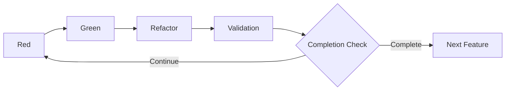
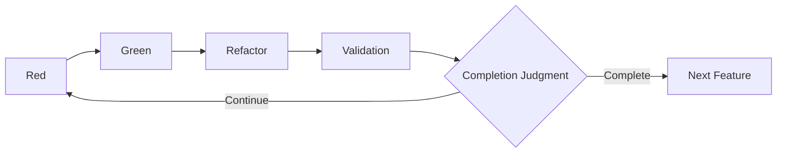

# 3.4 Red-Green-Refactor-Validation Cycle

## Overview of Extended TDD Cycle

At the heart of AITDD is an extended cycle that adds a **Validation** step to traditional TDD (Red-Green-Refactor). This cycle is primarily executed by AI under human supervision, enabling efficient generation of high-quality code.



## Details of the Red-Green-Refactor-Validation Cycle

### Red Phase: Confirm Failing Tests

#### Purpose

- Implement test cases
- Confirm that tests fail as expected
- Validate correctness of the tests themselves

#### Concrete work items

##### 1. Implement test cases

```javascript
// Example: Implementing tests for User Registration
describe("User Registration", () => {
  test("should create user with valid data", async () => {
    const userData = {
      email: "test@example.com",
      password: "SecurePass123!",
      password_confirmation: "SecurePass123!",
    };

    const response = await request(app).post("/api/users").send(userData);

    expect(response.status).toBe(201);
    expect(response.body).toHaveProperty("id");
    expect(response.body.email).toBe(userData.email);

    // Confirm the database
    const user = await User.findByEmail(userData.email);
    expect(user).toBeTruthy();
    expect(user.password_hash).not.toBe(userData.password);
  });

  test("should reject duplicate email", async () => {
    // Create an existing user in advance
    await createUser({ email: "existing@example.com" });

    const duplicateData = {
      email: "existing@example.com",
      password: "NewPass456!",
    };

    const response = await request(app).post("/api/users").send(duplicateData);

    expect(response.status).toBe(400);
    expect(response.body.error).toBe("validation_failed");
    expect(response.body.details[0].field).toBe("email");
  });
});
```

##### 2. Run tests and confirm failures

```bash
$ npm test
❌ User Registration › should create user with valid data
   Error: Cannot POST /api/users

❌ User Registration › should reject duplicate email
   Error: Cannot POST /api/users
```

##### 3. Identify failure reasons

- Endpoint not implemented
- Missing dependencies
- Test environment misconfiguration

#### Running the Red phase with AI

##### Example prompt

```markdown
## Instruction: Run the Red phase

### Background

- Feature: User registration API
- Test case specification: See testcases.md
- Existing code: Check under src/

### Tasks

1. Implement each test case in testcases.md as Jest tests
2. Run the tests and confirm expected failures
3. Organize and report the reasons for failures

### Output format

- Full test code
- Test execution results
- Analysis of failure reasons
- Suggestions for the next Green phase
```

### Green Phase: Minimal Implementation

#### Purpose

- Implement the minimal code to pass the tests
- Avoid over-implementation and maintain test-driven flow
- Leave room for improvement in the Refactor phase

#### Concrete work items

##### 1. Minimal API implementation

```javascript
// routes/users.js
const express = require("express");
const bcrypt = require("bcrypt");
const User = require("../models/User");
const router = express.Router();

router.post("/users", async (req, res) => {
  try {
    const { email, password, password_confirmation } = req.body;

    // Basic validation
    if (!email || !password || !password_confirmation) {
      return res.status(400).json({
        error: "validation_failed",
        details: [{ field: "required", message: "Missing required fields" }],
      });
    }

    if (password !== password_confirmation) {
      return res.status(400).json({
        error: "validation_failed",
        details: [
          {
            field: "password",
            message: "Password confirmation does not match",
          },
        ],
      });
    }

    // Duplicate check
    const existingUser = await User.findByEmail(email);
    if (existingUser) {
      return res.status(400).json({
        error: "validation_failed",
        details: [{ field: "email", message: "Email already exists" }],
      });
    }

    // Hash password
    const password_hash = await bcrypt.hash(password, 10);

    // Create user
    const user = await User.create({
      email,
      password_hash,
    });

    res.status(201).json({
      id: user.id,
      email: user.email,
      created_at: user.created_at,
    });
  } catch (error) {
    console.error("User creation error:", error);
    res.status(500).json({ error: "Internal server error" });
  }
});

module.exports = router;
```

##### 2. Minimal model implementation

```javascript
// models/User.js
const db = require("../database");

class User {
  static async findByEmail(email) {
    const result = await db.query("SELECT * FROM users WHERE email = ?", [
      email,
    ]);
    return result[0] || null;
  }

  static async create({ email, password_hash }) {
    const result = await db.query(
      "INSERT INTO users (email, password_hash, created_at) VALUES (?, ?, NOW())",
      [email, password_hash]
    );

    return {
      id: result.insertId,
      email,
      created_at: new Date(),
    };
  }
}

module.exports = User;
```

##### 3. Run tests and confirm success

```bash
$ npm test
✅ User Registration › should create user with valid data
✅ User Registration › should reject duplicate email

Tests: 2 passed, 2 total
```

#### Running the Green phase with AI

##### Example prompt

```markdown
## Instruction: Run the Green phase

### Background

- Failing tests: [Results from the Red phase]
- Requirements: See requirements.md
- Existing code structure: Check under src/

### Tasks

1. Implement the minimal code to pass failing tests
2. Avoid over-implementation beyond the test cases
3. Run tests and confirm success for all cases

### Constraints

- Adhere to the principle of minimal implementation
- Do not implement features outside test cases
- Maintain consistency with existing code

### Output format

- Full implementation code
- Test execution results
- Explanation of implementation policy
```

### Refactor Phase: Improve Code

#### Purpose

- Improve code quality
- Enhance maintainability and readability
- Optimize performance
- Keep all tests passing

#### Concrete work items

##### 1. Improve code structure

```javascript
// services/UserService.js - Separate business logic
class UserService {
  constructor(userRepository, passwordHasher) {
    this.userRepository = userRepository;
    this.passwordHasher = passwordHasher;
  }

  async createUser({ email, password, password_confirmation }) {
    // Validation
    this.validateUserInput({ email, password, password_confirmation });

    // Duplicate check
    await this.checkEmailUniqueness(email);

    // Create user
    const password_hash = await this.passwordHasher.hash(password);
    return await this.userRepository.create({ email, password_hash });
  }

  validateUserInput({ email, password, password_confirmation }) {
    const errors = [];

    if (!this.isValidEmail(email)) {
      errors.push({ field: "email", message: "Invalid email format" });
    }

    if (!this.isValidPassword(password)) {
      errors.push({
        field: "password",
        message: "Password does not meet requirements",
      });
    }

    if (password !== password_confirmation) {
      errors.push({
        field: "password_confirmation",
        message: "Password confirmation does not match",
      });
    }

    if (errors.length > 0) {
      throw new ValidationError(errors);
    }
  }

  async checkEmailUniqueness(email) {
    const existingUser = await this.userRepository.findByEmail(email);
    if (existingUser) {
      throw new ValidationError([
        { field: "email", message: "Email already exists" },
      ]);
    }
  }

  isValidEmail(email) {
    const emailRegex = /^[^\s@]+@[^\s@]+\.[^\s@]+$/;
    return email && email.length <= 254 && emailRegex.test(email);
  }

  isValidPassword(password) {
    if (!password || password.length < 8) return false;

    const hasUpperCase = /[A-Z]/.test(password);
    const hasLowerCase = /[a-z]/.test(password);
    const hasNumbers = /\d/.test(password);
    const hasSymbols = /[!@#$%^&*()_+\-=\[\]{};':"\\|,.<>\/?]/.test(password);

    return hasUpperCase && hasLowerCase && hasNumbers && hasSymbols;
  }
}

// Simplify controller
router.post("/users", async (req, res) => {
  try {
    const user = await userService.createUser(req.body);
    res.status(201).json({
      id: user.id,
      email: user.email,
      created_at: user.created_at,
    });
  } catch (error) {
    if (error instanceof ValidationError) {
      return res.status(400).json({
        error: "validation_failed",
        details: error.details,
      });
    }

    console.error("User creation error:", error);
    res.status(500).json({ error: "Internal server error" });
  }
});
```

##### 2. Improve error handling

```javascript
// errors/ValidationError.js
class ValidationError extends Error {
  constructor(details) {
    super("Validation failed");
    this.name = "ValidationError";
    this.details = details;
  }
}

// middlewares/errorHandler.js
const errorHandler = (error, req, res, next) => {
  if (error instanceof ValidationError) {
    return res.status(400).json({
      error: "validation_failed",
      details: error.details,
    });
  }

  console.error("Unhandled error:", error);
  res.status(500).json({ error: "Internal server error" });
};
```

##### 3. Run tests to confirm quality remains

```bash
$ npm test
✅ User Registration › should create user with valid data
✅ User Registration › should reject duplicate email
✅ User Registration › should validate email format
✅ User Registration › should validate password strength

Tests: 4 passed, 4 total
```

#### Running the Refactor phase with AI

##### Example prompt

```markdown
## Instruction: Run the Refactor phase

### Background

- Current code: [Results of the Green phase]
- Test status: All tests passing
- Quality goals: Maintainability, readability, performance

### Tasks

1. Improve code structure (separation of concerns, DRY)
2. Standardize error handling
3. Optimize performance
4. Apply coding standards
5. Confirm quality by running tests

### Constraints

- Do not break existing tests
- Avoid excessive architectural changes
- Emphasize incremental improvements

### Output format

- Refactored code
- Explanation of improvements
- Test execution results
```

### Validation Phase: Comprehensive Verification

#### Purpose

- Comprehensively verify implementation validity
- Check conformance to quality standards
- Evaluate whether additional test cases are necessary
- Make completion decision

#### Concrete verification items

##### 1. Confirm implementation status of test cases

```markdown
## Confirm status of test-case implementation

### Planned test cases (from testcases.md)

- [x] TC001: Successful user registration
- [x] TC002: Duplicate email error
- [x] TC003: Password mismatch error
- [x] TC004: Invalid email format
- [x] TC005: Insufficient password strength
- [x] TC006: Missing required fields
- [x] TC007: Boundary test – email length
- [ ] TC008: Rate limiting test (not implemented)
- [ ] TC009: Database connection error (not implemented)
- [x] TC010: CSRF token verification

### Implementation rate: 80% (8/10)
```

##### 2. Confirm regression of existing tests

```bash
$ npm test
✅ User Authentication › should login with valid credentials
✅ User Authentication › should reject invalid password
✅ User Registration › should create user with valid data
✅ User Registration › should reject duplicate email
✅ Product Management › should create product
✅ Product Management › should list products

Tests: 6 passed, 6 total
Time: 2.341s
```

##### 3. Confirm code-quality metrics

```bash
$ npm run quality-check
✅ ESLint: 0 errors, 0 warnings
✅ Test Coverage: 95% statements, 92% branches
✅ Code Complexity: Average 3.2 (Good)
✅ Dependency Check: No vulnerabilities found
```

##### 4. Confirm conformance to specification

```markdown
## Specification conformance check

### Functional requirements

- [x] New user registration via email/password
- [x] Duplicate email validation
- [x] Password strength check
- [x] Password hashing (bcrypt)

### Non-functional requirements

- [x] Response time: average 1.2s (≤ 2s)
- [ ] Concurrent registration: Load test not yet performed
- [x] Password hashing is required

### API specifications

- [x] POST /api/users endpoint
- [x] Expected request/response format
- [x] Appropriate HTTP status codes

### Database design

- [x] users table design
- [x] Appropriate indexes
- [x] Implement constraints
```

##### 5. Confirm security requirements

```markdown
## Security check

### Password management

- [x] No plaintext password storage
- [x] Hashing with bcrypt
- [x] Appropriate salt usage

### Input validation

- [x] SQL injection countermeasures
- [x] XSS countermeasures
- [x] CSRF token verification

### Access control

- [x] Appropriate HTTP status codes
- [x] Appropriate limitation of error information
```

#### Running the Validation phase with AI

##### Example prompt

```markdown
## Instruction: Run the Validation phase

### Background

- Completed implementation: [Results of the Refactor phase]
- Requirements: requirements.md
- Test cases: testcases.md
- Existing system: Entire codebase

### Verification items

1. Confirm implementation status of all test cases listed in testcases.md
2. Run regression tests of existing tests
3. Confirm fulfillment of requirements in requirements.md
4. Measure code-quality metrics
5. Confirm security requirements

### Completion criteria

- 90% or higher implementation rate for planned test cases
- All existing tests pass
- 100% fulfillment of important requirements
- No critical security issues

### Output format

- Verification report
- List of unimplemented test cases
- Quality metrics
- Reasons for completion/continuation decision
```

#### Decision Criteria for the Validation Phase

##### ✅ Complete (proceed automatically)

```markdown
### Completion criteria

- Status of existing tests: All pass
- Implementation rate for test cases: ≥ 90%
- Fulfillment rate of important requirements: 100%
- Code coverage: ≥ 80%
- Security check: No critical issues
```

##### ⚠️ Continue (additional implementation needed)

```markdown
### Continuation criteria

- Existing tests: Failures present
- Test-case implementation rate: < 90%
- Important requirements: Not fully satisfied
- Quality metrics: Below threshold
- Security: Critical issues found
```

## Managing the Entire Cycle

### Process control

#### 1. Automate cycle execution

```markdown
## Example AITDD execution script

### Inputs

- requirements.md
- testcases.md
- Existing codebase

### Execution flow

1. Red: Implement and run test cases
2. Green: Minimal implementation
3. Refactor: Improve code
4. Validation: Comprehensive verification
5. Decision: Automatic completion/continuation

### Outputs

- Implementation code
- Test results
- Quality report
- Recommendations for next steps
```

#### 2. Visualize progress

```markdown
## Progress tracking

### Test-case progress

- Implemented: 8/10 (80%)
- Passed: 8/8 (100%)
- Failed: 0/8 (0%)

### Quality metrics

- Coverage: 95%
- Complexity: 3.2 (Good)
- Duplication: 2% (Good)

### Requirement fulfillment

- Functional requirements: 100%
- Non-functional requirements: 80%
- Security requirements: 100%
```

### Points of Human Intervention

#### 1. When important decisions are needed

- Major architectural changes
- Interpretation of security requirements
- Adjustment of performance requirements
- Complex decisions in business logic

#### 2. Adjust quality standards

- Target for test coverage
- Acceptable code complexity
- Review performance requirements

#### 3. Optimize the process

- Improve cycle execution time
- Increase precision of AI instructions
- Expand scope of automation

## Error Handling and Debugging

### Common problems and countermeasures

#### 1. Tests do not fail correctly in the Red phase

**Cause**: Mistakes implementing test cases, environment configuration issues  
**Countermeasure**: Re-check test-case specifications, re-initialize the environment

#### 2. Over-implementation in the Green phase

**Cause**: Lack of understanding of the minimal implementation principle  
**Countermeasure**: Adhere strictly to test-driven development, clarify implementation scope

#### 3. Tests break in the Refactor phase

**Cause**: Logical changes during refactoring  
**Countermeasure**: Refactor incrementally, run tests continuously

#### 4. Thresholds not met in the Validation phase

**Cause**: Insufficient understanding of requirements, misconfigured quality standards  
**Countermeasure**: Reconfirm requirements, adjust thresholds

## Next Steps

Once you understand the Red-Green-Refactor-Validation cycle, proceed to [Details of the Validation Step](./05-validation-details.md) to learn deeper quality-management techniques.

### Learning points

- [ ] Understood purposes and tasks of each phase
- [ ] Grasped division of roles between AI and humans
- [ ] Mastered quality management across the entire cycle
- [ ] Learned basic error-handling patterns

By mastering this cycle, you will be able to efficiently develop high-quality software while making maximum use of AI.

# 3.4 Red-Green-Refactor-Validation Cycle

## Overview of Extended TDD Cycle

The core of AITDD is an extended cycle that adds a **Validation** step to traditional TDD (Red-Green-Refactor). This cycle is primarily executed by AI but conducted under human supervision, efficiently generating high-quality code.



## Red-Green-Refactor-Validation Cycle Details

### Red Phase: Confirm Test Failure

#### Purpose

- Implement test cases
- Confirm tests fail as expected
- Verify the validity of tests themselves

#### Specific Work Content

##### 1. Test Case Implementation

```javascript
// Example: User registration functionality test implementation
describe("User Registration", () => {
  test("should create user with valid data", async () => {
    const userData = {
      email: "test@example.com",
      password: "SecurePass123!",
      password_confirmation: "SecurePass123!",
    };

    const response = await request(app).post("/api/users").send(userData);

    expect(response.status).toBe(201);
    expect(response.body).toHaveProperty("id");
    expect(response.body.email).toBe(userData.email);

    // Database verification
    const user = await User.findByEmail(userData.email);
    expect(user).toBeTruthy();
    expect(user.password_hash).not.toBe(userData.password);
  });

  test("should reject duplicate email", async () => {
    // Pre-create existing user
    await createUser({ email: "existing@example.com" });

    const duplicateData = {
      email: "existing@example.com",
      password: "NewPass456!",
    };

    const response = await request(app).post("/api/users").send(duplicateData);

    expect(response.status).toBe(400);
    expect(response.body.error).toBe("validation_failed");
    expect(response.body.details[0].field).toBe("email");
  });
});
```

##### 2. Test Execution and Failure Confirmation

```bash
$ npm test
❌ User Registration › should create user with valid data
   Error: Cannot POST /api/users

❌ User Registration › should reject duplicate email
   Error: Cannot POST /api/users
```

##### 3. Confirm Failure Reasons

- Endpoint not implemented
- Missing required dependencies
- Test environment configuration issues

#### AI Execution of Red Phase

##### Prompt Example

```markdown
## Instruction: Execute Red Phase

### Background

- Feature: User registration API
- Test case specification: See testcases.md
- Existing code: Check under src/

### Tasks

1. Implement each test case in testcases.md as Jest tests
2. Run the tests and confirm expected failures
3. Organize and report the reasons for failures

### Output format

- Full test code
- Test execution results
- Analysis of failure reasons
- Suggestions for the next Green phase
```

### Green Phase: Minimal Implementation

#### Purpose

- Implement the minimal code to pass the tests
- Avoid over-implementation and maintain test-driven flow
- Leave room for improvement in the Refactor phase

#### Concrete work items

##### 1. Minimal API implementation

```javascript
// routes/users.js
const express = require("express");
const bcrypt = require("bcrypt");
const User = require("../models/User");
const router = express.Router();

router.post("/users", async (req, res) => {
  try {
    const { email, password, password_confirmation } = req.body;

    // Basic validation
    if (!email || !password || !password_confirmation) {
      return res.status(400).json({
        error: "validation_failed",
        details: [{ field: "required", message: "Missing required fields" }],
      });
    }

    if (password !== password_confirmation) {
      return res.status(400).json({
        error: "validation_failed",
        details: [
          {
            field: "password",
            message: "Password confirmation does not match",
          },
        ],
      });
    }

    // Duplicate check
    const existingUser = await User.findByEmail(email);
    if (existingUser) {
      return res.status(400).json({
        error: "validation_failed",
        details: [{ field: "email", message: "Email already exists" }],
      });
    }

    // Hash password
    const password_hash = await bcrypt.hash(password, 10);

    // Create user
    const user = await User.create({
      email,
      password_hash,
    });

    res.status(201).json({
      id: user.id,
      email: user.email,
      created_at: user.created_at,
    });
  } catch (error) {
    console.error("User creation error:", error);
    res.status(500).json({ error: "Internal server error" });
  }
});

module.exports = router;
```

##### 2. Minimal model implementation

```javascript
// models/User.js
const db = require("../database");

class User {
  static async findByEmail(email) {
    const result = await db.query("SELECT * FROM users WHERE email = ?", [
      email,
    ]);
    return result[0] || null;
  }

  static async create({ email, password_hash }) {
    const result = await db.query(
      "INSERT INTO users (email, password_hash, created_at) VALUES (?, ?, NOW())",
      [email, password_hash]
    );

    return {
      id: result.insertId,
      email,
      created_at: new Date(),
    };
  }
}

module.exports = User;
```

##### 3. Run tests and confirm success

```bash
$ npm test
✅ User Registration › should create user with valid data
✅ User Registration › should reject duplicate email

Tests: 2 passed, 2 total
```

#### Running the Green phase with AI

##### Example prompt

```markdown
## Instruction: Run the Green phase

### Background

- Failing tests: [Results from the Red phase]
- Requirements: See requirements.md
- Existing code structure: Check under src/

### Tasks

1. Implement the minimal code to pass failing tests
2. Avoid over-implementation beyond the test cases
3. Run tests and confirm success for all cases

### Constraints

- Adhere to the principle of minimal implementation
- Do not implement features outside test cases
- Maintain consistency with existing code

### Output format

- Full implementation code
- Test execution results
- Explanation of implementation policy
```

### Refactor Phase: Improve Code

#### Purpose

- Improve code quality
- Enhance maintainability and readability
- Optimize performance
- Keep all tests passing

#### Concrete work items

##### 1. Improve code structure

```javascript
// services/UserService.js - Separate business logic
class UserService {
  constructor(userRepository, passwordHasher) {
    this.userRepository = userRepository;
    this.passwordHasher = passwordHasher;
  }

  async createUser({ email, password, password_confirmation }) {
    // Validation
    this.validateUserInput({ email, password, password_confirmation });

    // Duplicate check
    await this.checkEmailUniqueness(email);

    // Create user
    const password_hash = await this.passwordHasher.hash(password);
    return await this.userRepository.create({ email, password_hash });
  }

  validateUserInput({ email, password, password_confirmation }) {
    const errors = [];

    if (!this.isValidEmail(email)) {
      errors.push({ field: "email", message: "Invalid email format" });
    }

    if (!this.isValidPassword(password)) {
      errors.push({
        field: "password",
        message: "Password does not meet requirements",
      });
    }

    if (password !== password_confirmation) {
      errors.push({
        field: "password_confirmation",
        message: "Password confirmation does not match",
      });
    }

    if (errors.length > 0) {
      throw new ValidationError(errors);
    }
  }

  async checkEmailUniqueness(email) {
    const existingUser = await this.userRepository.findByEmail(email);
    if (existingUser) {
      throw new ValidationError([
        { field: "email", message: "Email already exists" },
      ]);
    }
  }

  isValidEmail(email) {
    const emailRegex = /^[^\s@]+@[^\s@]+\.[^\s@]+$/;
    return email && email.length <= 254 && emailRegex.test(email);
  }

  isValidPassword(password) {
    if (!password || password.length < 8) return false;

    const hasUpperCase = /[A-Z]/.test(password);
    const hasLowerCase = /[a-z]/.test(password);
    const hasNumbers = /\d/.test(password);
    const hasSymbols = /[!@#$%^&*()_+\-=\[\]{};':"\\|,.<>\/?]/.test(password);

    return hasUpperCase && hasLowerCase && hasNumbers && hasSymbols;
  }
}

// Simplify controller
router.post("/users", async (req, res) => {
  try {
    const user = await userService.createUser(req.body);
    res.status(201).json({
      id: user.id,
      email: user.email,
      created_at: user.created_at,
    });
  } catch (error) {
    if (error instanceof ValidationError) {
      return res.status(400).json({
        error: "validation_failed",
        details: error.details,
      });
    }

    console.error("User creation error:", error);
    res.status(500).json({ error: "Internal server error" });
  }
});
```

##### 2. Improve error handling

```javascript
// errors/ValidationError.js
class ValidationError extends Error {
  constructor(details) {
    super("Validation failed");
    this.name = "ValidationError";
    this.details = details;
  }
}

// middlewares/errorHandler.js
const errorHandler = (error, req, res, next) => {
  if (error instanceof ValidationError) {
    return res.status(400).json({
      error: "validation_failed",
      details: error.details,
    });
  }

  console.error("Unhandled error:", error);
  res.status(500).json({ error: "Internal server error" });
};
```

##### 3. Run tests to confirm quality remains

```bash
$ npm test
✅ User Registration › should create user with valid data
✅ User Registration › should reject duplicate email
✅ User Registration › should validate email format
✅ User Registration › should validate password strength

Tests: 4 passed, 4 total
```

#### Running the Refactor phase with AI

##### Example prompt

```markdown
## Instruction: Run the Refactor phase

### Background

- Current code: [Results of the Green phase]
- Test status: All tests passing
- Quality goals: Maintainability, readability, performance

### Tasks

1. Improve code structure (separation of concerns, DRY)
2. Standardize error handling
3. Optimize performance
4. Apply coding standards
5. Confirm quality by running tests

### Constraints

- Do not break existing tests
- Avoid excessive architectural changes
- Emphasize incremental improvements

### Output format

- Refactored code
- Explanation of improvements
- Test execution results
```

### Validation Phase: Comprehensive Verification

#### Purpose

- Comprehensively verify implementation validity
- Check conformance to quality standards
- Evaluate whether additional test cases are necessary
- Make completion decision

#### Concrete verification items

##### 1. Confirm implementation status of test cases

```markdown
## Confirm status of test-case implementation

### Planned test cases (from testcases.md)

- [x] TC001: Successful user registration
- [x] TC002: Duplicate email error
- [x] TC003: Password mismatch error
- [x] TC004: Invalid email format
- [x] TC005: Insufficient password strength
- [x] TC006: Missing required fields
- [x] TC007: Boundary test – email length
- [ ] TC008: Rate limiting test (not implemented)
- [ ] TC009: Database connection error (not implemented)
- [x] TC010: CSRF token verification

### Implementation rate: 80% (8/10)
```

##### 2. Confirm regression of existing tests

```bash
$ npm test
✅ User Authentication › should login with valid credentials
✅ User Authentication › should reject invalid password
✅ User Registration › should create user with valid data
✅ User Registration › should reject duplicate email
✅ Product Management › should create product
✅ Product Management › should list products

Tests: 6 passed, 6 total
Time: 2.341s
```

##### 3. Confirm code-quality metrics

```bash
$ npm run quality-check
✅ ESLint: 0 errors, 0 warnings
✅ Test Coverage: 95% statements, 92% branches
✅ Code Complexity: Average 3.2 (Good)
✅ Dependency Check: No vulnerabilities found
```

##### 4. Confirm conformance to specification

```markdown
## Specification conformance check

### Functional requirements

- [x] New user registration via email/password
- [x] Duplicate email validation
- [x] Password strength check
- [x] Password hashing (bcrypt)

### Non-functional requirements

- [x] Response time: average 1.2s (≤ 2s)
- [ ] Concurrent registration: Load test not yet performed
- [x] Password hashing is required

### API specifications

- [x] POST /api/users endpoint
- [x] Expected request/response format
- [x] Appropriate HTTP status codes

### Database design

- [x] users table design
- [x] Appropriate indexes
- [x] Implement constraints
```

##### 5. Confirm security requirements

```markdown
## Security check

### Password management

- [x] No plaintext password storage
- [x] Hashing with bcrypt
- [x] Appropriate salt usage

### Input validation

- [x] SQL injection countermeasures
- [x] XSS countermeasures
- [x] CSRF token verification

### Access control

- [x] Appropriate HTTP status codes
- [x] Appropriate limitation of error information
```

#### Running the Validation phase with AI

##### Example prompt

```markdown
## Instruction: Run the Validation phase

### Background

- Completed implementation: [Results of the Refactor phase]
- Requirements: requirements.md
- Test cases: testcases.md
- Existing system: Entire codebase

### Verification items

1. Confirm implementation status of all test cases listed in testcases.md
2. Run regression tests of existing tests
3. Confirm fulfillment of requirements in requirements.md
4. Measure code-quality metrics
5. Confirm security requirements

### Completion criteria

- 90% or higher implementation rate for planned test cases
- All existing tests pass
- 100% fulfillment of important requirements
- No critical security issues

### Output format

- Verification report
- List of unimplemented test cases
- Quality metrics
- Reasons for completion/continuation decision
```

#### Decision Criteria for the Validation Phase

##### ✅ Complete (proceed automatically)

```markdown
### Completion criteria

- Status of existing tests: All pass
- Implementation rate for test cases: ≥ 90%
- Fulfillment rate of important requirements: 100%
- Code coverage: ≥ 80%
- Security check: No critical issues
```

##### ⚠️ Continue (additional implementation needed)

```markdown
### Continuation criteria

- Existing tests: Failures present
- Test-case implementation rate: < 90%
- Important requirements: Not fully satisfied
- Quality metrics: Below threshold
- Security: Critical issues found
```

## Managing the Entire Cycle

### Process control

#### 1. Automate cycle execution

```markdown
## Example AITDD execution script

### Inputs

- requirements.md
- testcases.md
- Existing codebase

### Execution flow

1. Red: Implement and run test cases
2. Green: Minimal implementation
3. Refactor: Improve code
4. Validation: Comprehensive verification
5. Decision: Automatic completion/continuation

### Outputs

- Implementation code
- Test results
- Quality report
- Recommendations for next steps
```

#### 2. Visualize progress

```markdown
## Progress tracking

### Test-case progress

- Implemented: 8/10 (80%)
- Passed: 8/8 (100%)
- Failed: 0/8 (0%)

### Quality metrics

- Coverage: 95%
- Complexity: 3.2 (Good)
- Duplication: 2% (Good)

### Requirement fulfillment

- Functional requirements: 100%
- Non-functional requirements: 80%
- Security requirements: 100%
```

### Points of Human Intervention

#### 1. When important decisions are needed

- Major architectural changes
- Interpretation of security requirements
- Adjustment of performance requirements
- Complex decisions in business logic

#### 2. Adjust quality standards

- Target for test coverage
- Acceptable code complexity
- Review performance requirements

#### 3. Optimize the process

- Improve cycle execution time
- Increase precision of AI instructions
- Expand scope of automation

## Error Handling and Debugging

### Common problems and countermeasures

#### 1. Tests do not fail correctly in the Red phase

**Cause**: Mistakes implementing test cases, environment configuration issues  
**Countermeasure**: Re-check test-case specifications, re-initialize the environment

#### 2. Over-implementation in the Green phase

**Cause**: Lack of understanding of the minimal implementation principle  
**Countermeasure**: Adhere strictly to test-driven development, clarify implementation scope

#### 3. Tests break in the Refactor phase

**Cause**: Logical changes during refactoring  
**Countermeasure**: Refactor incrementally, run tests continuously

#### 4. Thresholds not met in the Validation phase

**Cause**: Insufficient understanding of requirements, misconfigured quality standards  
**Countermeasure**: Reconfirm requirements, adjust thresholds

## Next Steps

Once you understand the Red-Green-Refactor-Validation cycle, proceed to [Details of the Validation Step](./05-validation-details.md) to learn deeper quality-management techniques.

### Learning points

- [ ] Understood purposes and tasks of each phase
- [ ] Grasped division of roles between AI and humans
- [ ] Mastered quality management across the entire cycle
- [ ] Learned basic error-handling patterns

By mastering this cycle, you will be able to efficiently develop high-quality software while making maximum use of AI.
