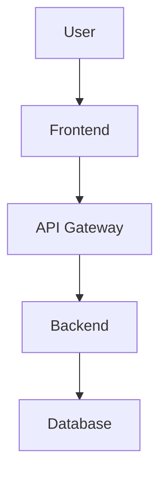
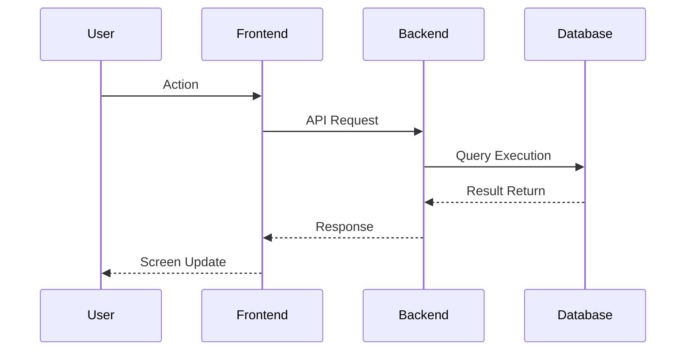

# kairo-design

## Purpose

Based on approved requirements definition documents, generate technical design documents. Perform comprehensive design including data flow diagrams, TypeScript interfaces, database schemas, and API endpoints.

## Prerequisites

- Requirements definition documents exist in `docs/spec/`
- Requirements have been approved by user

## Execution Content

**Reliability Level Instructions**:
For each item, briefly indicate the verification status with original materials using:

- 🟢 **Green**: Based on existing documents
- 🟡 **Yellow**: Reasonable inference from documents
- 🔴 **Red**: Requires speculation

1. **Requirements Analysis**

   - Search for requirements definition documents using @agent-symbol-searcher and read found files with Read tool
   - Check related existing design documents using @agent-symbol-searcher and read found files with Read tool
   - Organize functional and non-functional requirements
   - Clarify system boundaries

2. **Architecture Design**

   - Determine overall system architecture
   - Frontend/backend separation
   - Consider necessity of microservices

3. **Data Flow Diagram Creation**

   - Visualize data flow using Mermaid notation
   - User interaction flow
   - Data flow between systems

4. **TypeScript Interface Definition**

   - Entity type definition
   - API request/response type definition
   - Common type definition

5. **Database Schema Design**

   - Table definition
   - Relationships
   - Index strategy
   - Normalization level determination

6. **API Endpoint Design**

   - RESTful API design
   - Endpoint naming conventions
   - Proper use of HTTP methods
   - Request/response structure

7. **File Creation**
   - Create the following in `docs/design/{requirement-name}/` directory:
     - `architecture.md` - Architecture overview
     - `dataflow.md` - Data flow diagram
     - `interfaces.ts` - TypeScript type definitions
     - `database-schema.sql` - Database schema
     - `api-endpoints.md` - API specifications

## Output Format Examples

### architecture.md

```markdown
# {requirement-name} Architecture Design

## System Overview

{System overview description}

## Architecture Pattern

- Pattern: {selected pattern}
- Reason: {selection reason}

## Component Composition

### Frontend

- Framework: {framework used}
- State Management: {state management method}

### Backend

- Framework: {framework used}
- Authentication Method: {authentication method}

### Database

- DBMS: {DBMS to use}
- Cache: {cache strategy}
```

### dataflow.md

````markdown
# Data Flow Diagram

## User Interaction Flow


````

## Data Processing Flow



````

### interfaces.ts

```typescript
// Entity definitions
export interface User {
  id: string;
  email: string;
  name: string;
  createdAt: Date;
  updatedAt: Date;
}

// API request/response
export interface CreateUserRequest {
  email: string;
  name: string;
  password: string;
}

export interface ApiResponse<T> {
  success: boolean;
  data?: T;
  error?: {
    code: string;
    message: string;
  };
}
````

### database-schema.sql

```sql
-- User table
CREATE TABLE users (
    id UUID PRIMARY KEY DEFAULT gen_random_uuid(),
    email VARCHAR(255) UNIQUE NOT NULL,
    name VARCHAR(255) NOT NULL,
    created_at TIMESTAMP DEFAULT CURRENT_TIMESTAMP,
    updated_at TIMESTAMP DEFAULT CURRENT_TIMESTAMP
);

-- Indexes
CREATE INDEX idx_users_email ON users(email);
```

### api-endpoints.md

````markdown
# API Endpoint Specifications

## Authentication

### POST /auth/login

Request:

```json
{
  "email": "user@example.com",
  "password": "password"
}
```
````

Response:

```json
{
"success": true,
"data": {
"token": "jwt-token",
"user": { ... }
}
}
```

## User Management

### GET /users/:id

### POST /users

### PUT /users/:id

### DELETE /users/:id

```

## Post-execution Verification

- Verify consistency between created design and existing system using @agent-symbol-searcher
- Display list of created files
- Display summary of main design points
- Display message prompting user confirmation
```
