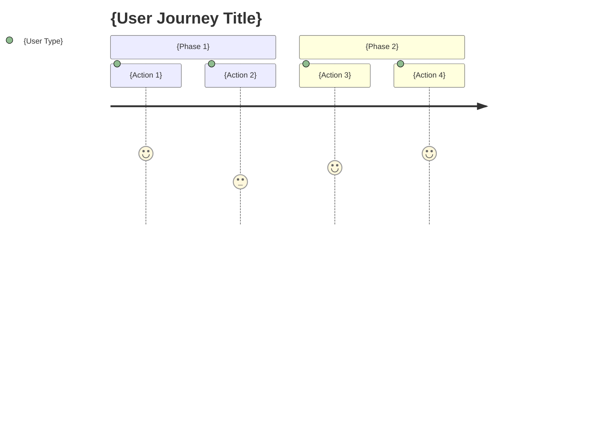

# kairo-requirements

## Purpose

Analyze requirement overviews provided by users and create detailed requirements definition documents including acceptance criteria using EARS (Easy Approach to Requirements Syntax) notation.

## Prerequisites

- Requirement overview has been provided by the user
- `docs/spec/` directory exists (create if it doesn't exist)

## Execution Content

**【Reliability Level Instructions】**:
For each item, comment on the verification status with original materials (including EARS requirements definition and design documents) using the following signals:

- 🟢 **Green Signal**: When referring to EARS requirements definition and design documents with minimal speculation
- 🟡 **Yellow Signal**: When making reasonable speculation based on EARS requirements definition and design documents
- 🔴 **Red Signal**: When speculation is not based on EARS requirements definition and design documents

1. **Requirements Analysis**

   - Understand the requirement overview provided by the user
   - Search for related existing requirements and design documents using @agent-symbol-searcher, and read found files with Read tool
   - Apply related domain knowledge
   - If there are unclear points, supplement based on general best practices

2. **User Story Creation**

   - Describe in WHO (who), WHAT (what), WHY (why) format
   - Clarify the value of each feature

3. **Requirements Definition Using EARS Notation**

   - **Normal Requirements (SHALL)**: Actions the system should normally perform
   - **Conditional Requirements (WHEN/IF-THEN)**: Actions under specific conditions
   - **State Requirements (WHERE)**: Actions in specific states
   - **Optional Requirements (MAY)**: Optional features
   - **Constraint Requirements (MUST)**: System constraints

4. **Edge Case Definition**

   - Exception handling
   - Boundary value processing
   - Error handling
   - Performance requirements

5. **File Creation**
   - `docs/spec/{requirement-name}-requirements.md`: Functional requirements and links to related documents
   - `docs/spec/{requirement-name}-user-stories.md`: Detailed user stories
   - `docs/spec/{requirement-name}-acceptance-criteria.md`: Acceptance criteria and test items
   - Create structured documents in markdown format

## Output Format Examples

### 1. requirements.md (Main File)

```markdown
# {requirement-name} Requirements Definition Document

## Overview

{requirement overview}

## Related Documents

- **User Stories**: [📖 {requirement-name}-user-stories.md]({requirement-name}-user-stories.md)
- **Acceptance Criteria**: [✅ {requirement-name}-acceptance-criteria.md]({requirement-name}-acceptance-criteria.md)

## Functional Requirements (EARS Notation)

### Normal Requirements

- REQ-001: The system shall {normal operation}
- REQ-002: The system shall {normal operation}

### Conditional Requirements

- REQ-101: When {condition}, the system shall {operation}
- REQ-102: When {condition}, the system shall {operation}

### State Requirements

- REQ-201: Where {state}, the system shall {operation}

### Optional Requirements

- REQ-301: The system may {optional feature}

### Constraint Requirements

- REQ-401: The system must {constraint}

## Non-functional Requirements

### Performance

- NFR-001: {performance requirement}

### Security

- NFR-101: {security requirement}

### Usability

- NFR-201: {usability requirement}

## Edge Cases

### Error Handling

- EDGE-001: {error case}

### Boundary Values

- EDGE-101: {boundary value case}
```

### 2. user-stories.md (Detailed User Stories)

````markdown
# {requirement-name} User Stories

## Overview

This document describes detailed user stories for {requirement-name} functionality.

## User Type Definitions

### Primary Users

- **End User**: {end user detailed description}
- **Administrator**: {administrator detailed description}
- **Developer**: {developer detailed description}

### Secondary Users

- **System Administrator**: {system administrator detailed description}
- **External System**: {external system detailed description}

## User Stories

### 📚 Epic 1: {large functionality group}

#### Story 1.1: {specific story name}

**User Story**:

- **As a** {user type} **I want to**
- **{specific situation/context}**
- **{action/operation I want to achieve}**
- **So that** {value gained/problem solved}

**Detailed Description**:

- **Background**: {why this functionality is needed}
- **Prerequisites**: {situation that is prerequisite for this story}
- **Usage Scenarios**: {examples of specific usage scenarios}
- **Expected Experience**: {detailed experience users expect}

**Related Requirements**: REQ-001, REQ-002

**Priority**: High/Medium/Low

**Estimate**: {story points or effort}

#### Story 1.2: {specific story name}

{Document in same format}

### 📚 Epic 2: {large functionality group}

{Document in same format}

## User Journey

### Journey 1: {representative usage flow}


````

**Details**:

1. **{Action 1}**: {detailed explanation}
2. **{Action 2}**: {detailed explanation}

## Persona Definitions

### Persona 1: {representative user name}

- **Basic Information**: {age, occupation, technical level, etc.}
- **Goals**: {what this user wants to achieve}
- **Challenges**: {problems currently faced}
- **Behavior Patterns**: {characteristics of typical behavior}
- **Usage Environment**: {devices used, environment, etc.}

## Non-functional User Requirements

### Usability Requirements

- **Learnability**: {learning cost for first-time use}
- **Efficiency**: {work efficiency after becoming proficient}
- **Memorability**: {ease of remembering for reuse}
- **Error Handling**: {ease of handling errors}
- **Satisfaction**: {subjective satisfaction}

### Accessibility Requirements

- **Visual**: {consideration for visually impaired}
- **Auditory**: {consideration for hearing impaired}
- **Motor**: {consideration for motor function impaired}
- **Cognitive**: {consideration for cognitively impaired}

````

### 3. acceptance-criteria.md (Acceptance Criteria)

```markdown
# {requirement-name} Acceptance Criteria

## Overview

This document describes acceptance criteria and test items for {requirement-name} functionality.

## Functional Test Criteria

### REQ-001: {requirement-name} Acceptance Criteria

**Given (Prerequisites)**:
- {state before test execution}
- {required initial data}

**When (Execution Conditions)**:
- {action to execute}
- {data to input}

**Then (Expected Results)**:
- {expected output/state}
- {side effects to verify}

**Test Cases**:
- [ ] Normal case: {detailed normal case}
- [ ] Abnormal case: {detailed abnormal case}
- [ ] Boundary value: {detailed boundary value test}

### REQ-002: {requirement-name} Acceptance Criteria

{Document in same format}

## Non-functional Test Criteria

### Performance Tests

**NFR-001: {performance requirement}**

- [ ] Response time: {specific time criteria}
- [ ] Throughput: {processing volume criteria}
- [ ] Concurrent connections: {concurrent user criteria}
- [ ] Resource usage: {CPU/memory usage criteria}

**Test Methods**:
- Load testing tools: {tools to use}
- Test scenarios: {specific test procedures}
- Pass criteria: {quantitative pass criteria}

### Security Tests

**NFR-101: {security requirement}**

- [ ] Authentication: {authentication function test items}
- [ ] Authorization: {access control test items}
- [ ] Data protection: {data encryption test items}
- [ ] Vulnerabilities: {security vulnerability test items}

## Usability Test Criteria

### UX/UI Tests

- [ ] Intuitive operability: {ease of understanding operations}
- [ ] Responsive design: {display on various devices}
- [ ] Accessibility: {WCAG 2.1 compliance}
- [ ] Error messages: {clear error display}

**Test Methods**:
- Usability testing: {implementation method}
- A/B testing: {comparison test method}
- Accessibility checks: {tools to use}

## Edge Case Test Criteria

### EDGE-001: {error case} Acceptance Criteria

**Test Scenarios**:
- {abnormal situation setup}
- {expected error handling}
- {appropriate user notification}

**Pass Criteria**:
- [ ] System doesn't crash
- [ ] Appropriate error messages are displayed
- [ ] Data integrity is maintained
- [ ] Recoverable state is maintained

## Integration Test Criteria

### System Interoperability Tests

- [ ] External API integration: {external system integration tests}
- [ ] Database integration: {DB operation consistency tests}
- [ ] File system: {file operation tests}

## Regression Test Criteria

### Existing Functionality Impact Verification

- [ ] Existing functionality operation verification: {identify and verify impact scope}
- [ ] Performance degradation verification: {verify existing functionality performance}
- [ ] Security setting verification: {verify security functionality continuity}

## Acceptance Test Execution Checklist

### Before Test Execution

- [ ] Test environment preparation complete
- [ ] Test data preparation complete
- [ ] Test tools preparation complete
- [ ] Execution personnel confirmation complete

### During Test Execution

- [ ] Execute all functional tests
- [ ] Execute all non-functional tests
- [ ] Record problems when discovered
- [ ] Re-test after fixes

### After Test Completion

- [ ] Record test results
- [ ] Organize remaining problems
- [ ] Determine acceptance/rejection
- [ ] Report to stakeholders
````

## Post-execution Verification

- Verify relevance of created requirements using @agent-symbol-searcher
- Display paths of the 3 created files
  - `docs/spec/{requirement-name}-requirements.md`
  - `docs/spec/{requirement-name}-user-stories.md`
  - `docs/spec/{requirement-name}-acceptance-criteria.md`
- Report the number of main requirements and user stories
- Verify that links within each file are correctly set
- Display message prompting user confirmation
