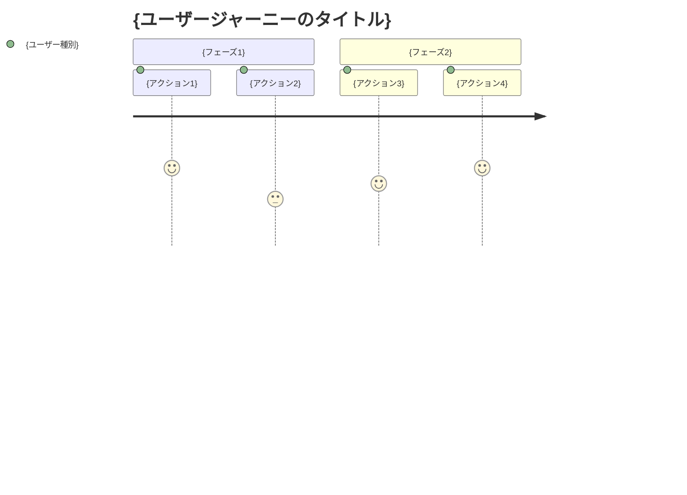

# kairo-requirements

## Purpose

Analyze requirement overviews provided by users and create detailed requirements definition documents including acceptance criteria using EARS (Easy Approach to Requirements Syntax) notation.

## Prerequisites

- Requirement overview has been provided by the user
- `docs/spec/` directory exists (create if it doesn't exist)

## Execution Content

**【Reliability Level Instructions】**:
For each item, comment on the verification status with original materials (including EARS requirements definition and design documents) using the following signals:

- 🟢 **Green Signal**: When referring to EARS requirements definition and design documents with minimal speculation
- 🟡 **Yellow Signal**: When making reasonable speculation based on EARS requirements definition and design documents
- 🔴 **Red Signal**: When speculation is not based on EARS requirements definition and design documents

1. **Requirements Analysis**

   - Understand the requirement overview provided by the user
   - Search for related existing requirements and design documents using @agent-symbol-searcher, and read found files with Read tool
   - Apply related domain knowledge
   - If there are unclear points, supplement based on general best practices

2. **User Story Creation**

   - Describe in WHO (who), WHAT (what), WHY (why) format
   - Clarify the value of each feature

3. **Requirements Definition Using EARS Notation**

   - **Normal Requirements (SHALL)**: Actions the system should normally perform
   - **Conditional Requirements (WHEN/IF-THEN)**: Actions under specific conditions
   - **State Requirements (WHERE)**: Actions in specific states
   - **Optional Requirements (MAY)**: Optional features
   - **Constraint Requirements (MUST)**: System constraints

4. **Edge Case Definition**

   - Exception handling
   - Boundary value processing
   - Error handling
   - Performance requirements

5. **File Creation**
   - `docs/spec/{requirement-name}-requirements.md`: Functional requirements and links to related documents
   - `docs/spec/{requirement-name}-user-stories.md`: Detailed user stories
   - `docs/spec/{requirement-name}-acceptance-criteria.md`: Acceptance criteria and test items
   - Create structured documents in markdown format

## Output Format Examples

### 1. requirements.md (Main File)

```markdown
# {requirement-name} Requirements Definition Document

## Overview

{requirement overview}

## Related Documents

- **User Stories**: [📖 {requirement-name}-user-stories.md]({requirement-name}-user-stories.md)
- **Acceptance Criteria**: [✅ {requirement-name}-acceptance-criteria.md]({requirement-name}-acceptance-criteria.md)

## Functional Requirements (EARS Notation)

### Normal Requirements

- REQ-001: The system shall {normal operation}
- REQ-002: The system shall {normal operation}

### Conditional Requirements

- REQ-101: When {condition}, the system shall {operation}
- REQ-102: When {condition}, the system shall {operation}

### State Requirements

- REQ-201: Where {state}, the system shall {operation}

### Optional Requirements

- REQ-301: The system may {optional feature}

### Constraint Requirements

- REQ-401: The system must {constraint}

## Non-functional Requirements

### Performance

- NFR-001: {performance requirement}

### Security

- NFR-101: {security requirement}

### Usability

- NFR-201: {usability requirement}

## Edge Cases

### Error Handling

- EDGE-001: {error case}

### Boundary Values

- EDGE-101: {boundary value case}
```

### 2. user-stories.md（詳細なユーザストーリー）

````markdown
# {要件名} ユーザストーリー

## 概要

このドキュメントは{要件名}機能の詳細なユーザストーリーを記載します。

## ユーザー種別の定義

### プライマリユーザー

- **エンドユーザー**: {エンドユーザーの詳細説明}
- **管理者**: {管理者の詳細説明}
- **開発者**: {開発者の詳細説明}

### セカンダリユーザー

- **システム管理者**: {システム管理者の詳細説明}
- **外部システム**: {外部システムの詳細説明}

## ユーザストーリー

### 📚 エピック 1: {大きな機能グループ}

#### ストーリー 1.1: {具体的なストーリー名}

**ユーザストーリー**:

- **私は** {ユーザー種別} **として**
- **{具体的な状況・コンテキスト} において**
- **{実現したい行動・操作} をしたい**
- **そうすることで** {得られる価値・解決される問題}

**詳細説明**:

- **背景**: {なぜこの機能が必要なのか}
- **前提条件**: {このストーリーの前提となる状況}
- **利用シーン**: {具体的な利用場面の例}
- **期待する体験**: {ユーザーが期待する体験の詳細}

**関連要件**: REQ-001, REQ-002

**優先度**: 高/中/低

**見積もり**: {ストーリーポイントまたは工数}

#### ストーリー 1.2: {具体的なストーリー名}

{同様の形式で記載}

### 📚 エピック 2: {大きな機能グループ}

{同様の形式で記載}

## ユーザージャーニー

### ジャーニー 1: {代表的な利用フロー}


````

**詳細**:

1. **{アクション 1}**: {詳細な説明}
2. **{アクション 2}**: {詳細な説明}

## ペルソナ定義

### ペルソナ 1: {代表的ユーザー名}

- **基本情報**: {年齢、職業、技術レベル等}
- **ゴール**: {このユーザーが達成したいこと}
- **課題**: {現在抱えている問題}
- **行動パターン**: {典型的な行動の特徴}
- **利用環境**: {使用するデバイス、環境等}

## 非機能的ユーザー要求

### ユーザビリティ要求

- **学習容易性**: {初回利用時の学習コスト}
- **効率性**: {熟練後の作業効率}
- **記憶しやすさ**: {再利用時の記憶のしやすさ}
- **エラー対応**: {エラー時の対応しやすさ}
- **満足度**: {主観的な満足度}

### アクセシビリティ要求

- **視覚**: {視覚障害者への配慮}
- **聴覚**: {聴覚障害者への配慮}
- **運動**: {運動機能障害者への配慮}
- **認知**: {認知障害者への配慮}

````

### 3. acceptance-criteria.md（受け入れ基準）

```markdown
# {要件名} 受け入れ基準

## 概要

このドキュメントは{要件名}機能の受け入れ基準とテスト項目を記載します。

## 機能テスト基準

### REQ-001: {要件名} の受け入れ基準

**Given（前提条件）**:
- {テスト実行前の状態}
- {必要な初期データ}

**When（実行条件）**:
- {実行するアクション}
- {入力するデータ}

**Then（期待結果）**:
- {期待される出力・状態}
- {確認すべき副作用}

**テストケース**:
- [ ] 正常系: {正常なケースの詳細}
- [ ] 異常系: {異常なケースの詳細}
- [ ] 境界値: {境界値テストの詳細}

### REQ-002: {要件名} の受け入れ基準

{同様の形式で記載}

## 非機能テスト基準

### パフォーマンステスト

**NFR-001: {パフォーマンス要件}**

- [ ] 応答時間: {具体的な時間基準}
- [ ] スループット: {処理量の基準}
- [ ] 同時接続数: {同時利用者数の基準}
- [ ] リソース使用量: {CPU・メモリ使用量の基準}

**テスト方法**:
- 負荷テストツール: {使用するツール}
- テストシナリオ: {具体的なテスト手順}
- 合格基準: {定量的な合格ライン}

### セキュリティテスト

**NFR-101: {セキュリティ要件}**

- [ ] 認証: {認証機能のテスト項目}
- [ ] 認可: {権限制御のテスト項目}
- [ ] データ保護: {データ暗号化のテスト項目}
- [ ] 脆弱性: {セキュリティ脆弱性のテスト項目}

## ユーザビリティテスト基準

### UX/UIテスト

- [ ] 直感的操作性: {操作の分かりやすさ}
- [ ] レスポンシブデザイン: {各デバイスでの表示}
- [ ] アクセシビリティ: {WCAG 2.1準拠}
- [ ] エラーメッセージ: {分かりやすいエラー表示}

**テスト方法**:
- ユーザビリティテスト: {実施方法}
- A/Bテスト: {比較テストの方法}
- アクセシビリティチェック: {使用するツール}

## Edgeケーステスト基準

### EDGE-001: {エラーケース} の受け入れ基準

**テストシナリオ**:
- {異常な状況の設定}
- {期待されるエラーハンドリング}
- {ユーザーへの適切な通知}

**合格基準**:
- [ ] システムがクラッシュしない
- [ ] 適切なエラーメッセージが表示される
- [ ] データの整合性が保たれる
- [ ] 復旧可能な状態を維持する

## 統合テスト基準

### システム間連携テスト

- [ ] 外部API連携: {外部システムとの連携テスト}
- [ ] データベース連携: {DB操作の整合性テスト}
- [ ] ファイルシステム: {ファイル操作のテスト}

## リグレッションテスト基準

### 既存機能影響確認

- [ ] 既存機能の動作確認: {影響範囲の特定と確認}
- [ ] パフォーマンス劣化確認: {既存機能の性能確認}
- [ ] セキュリティ設定確認: {セキュリティ機能の継続確認}

## 受け入れテスト実行チェックリスト

### テスト実行前

- [ ] テスト環境の準備完了
- [ ] テストデータの準備完了
- [ ] テストツールの準備完了
- [ ] 実行担当者の確認完了

### テスト実行中

- [ ] 全機能テストの実行
- [ ] 全非機能テストの実行
- [ ] 問題発見時の記録
- [ ] 修正後の再テスト

### テスト完了後

- [ ] テスト結果の記録
- [ ] 残存問題の整理
- [ ] 受け入れ可否の判定
- [ ] ステークホルダーへの報告
````

## Post-execution Verification

- Verify relevance of created requirements using @agent-symbol-searcher
- Display paths of the 3 created files
  - `docs/spec/{requirement-name}-requirements.md`
  - `docs/spec/{requirement-name}-user-stories.md`
  - `docs/spec/{requirement-name}-acceptance-criteria.md`
- Report the number of main requirements and user stories
- Verify that links within each file are correctly set
- Display message prompting user confirmation
