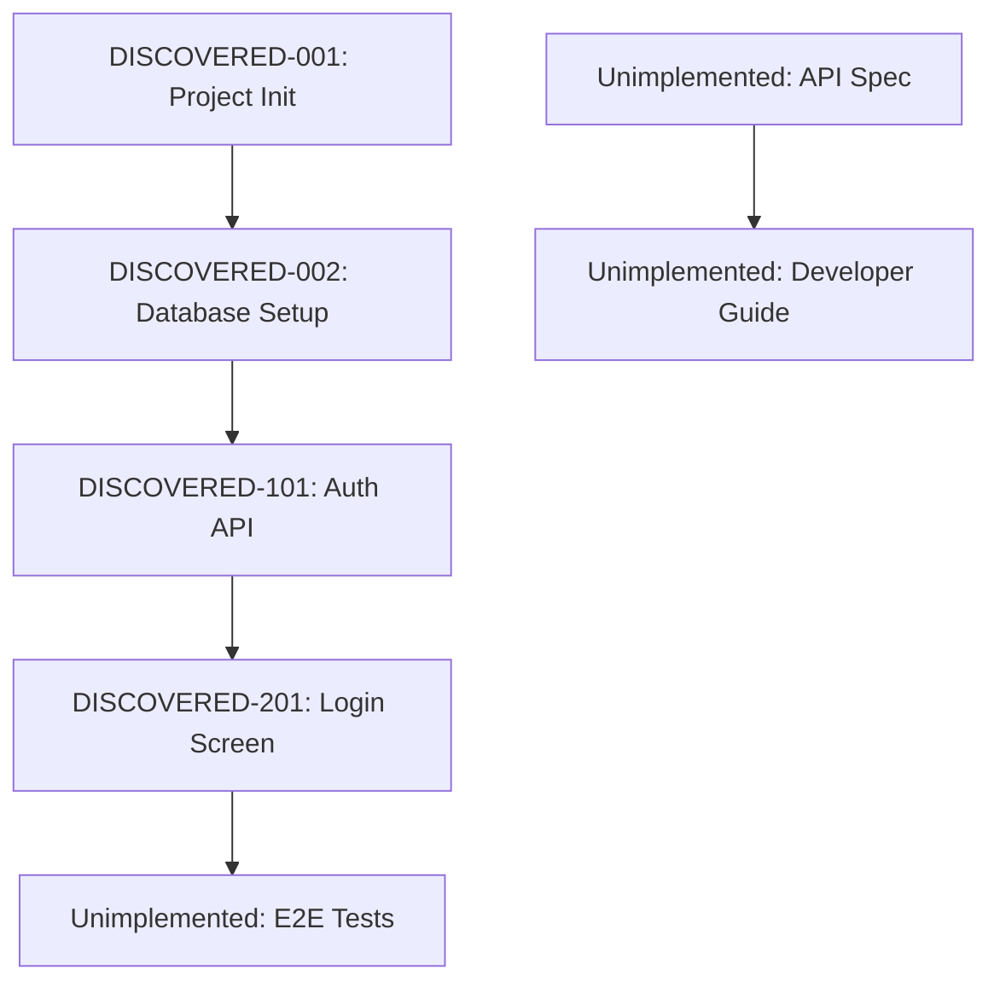

# rev-tasks

## Purpose

Analyze the existing codebase, identify implemented features, and organize them into a task list. Reverse-engineer task structure, dependencies, and implementation details from implemented features and document them.

## Prerequisites

- The target codebase to analyze exists
- The `docs/reverse/` directory exists (create it if it does not)
- Able to analyze TypeScript/JavaScript, Python, and other code

## Execution Content

1. **Codebase Structure Analysis**

   - Understand directory structure
   - Check configuration files (package.json, tsconfig.json, requirements.txt, etc.)
   - Analyze dependencies

2. **Identify Functional Components**

   - Frontend components
   - Backend services/controllers
   - Database (models, migrations)
   - Utility functions
   - Middleware

3. **Extract API Endpoints**

   - REST API endpoints
   - GraphQL resolvers
   - WebSocket handlers
   - Routing definitions

4. **Analyze Database Structure**

   - Table definitions
   - Relationships
   - Migration files
   - Index settings

5. **Analyze UI/UX Implementation**

   - Screen components
   - State management implementation
   - Routing
   - Styling approaches

6. **Check Test Implementations**

   - Presence of unit tests
   - Presence of integration tests
   - Presence of E2E tests
   - Test coverage

7. **Reverse-calculate and Organize Tasks**

   - Break down implemented features into tasks
   - Auto-assign task IDs
   - Estimate dependencies
   - Estimate implementation effort

8. **Create Files**
   - Save as `docs/reverse/{project-name}-discovered-tasks.md`
   - Structure and document discovered tasks

## Output Format Example

````markdown
# {project-name} Discovered Task List

## Overview

**Analysis Date/Time**: {timestamp}
**Target Codebase**: {path}
**Discovered Tasks**: {count}
**Estimated Total Effort**: {hours}

## Codebase Structure

### Project Info

- **Framework**: {frameworks used}
- **Languages**: {languages used}
- **Database**: {DB used}
- **Key Libraries**: {major dependencies}

### Directory Structure

```
{directory tree}
```

## Discovered Tasks

### Foundation / Configuration Tasks

#### DISCOVERED-001: Project Initialization

- [x] **Task Completed** (implemented)
- **Task Type**: DIRECT
- **Implementation Files**:
  - `package.json`
  - `tsconfig.json`
  - `.env.example`
- **Implementation Details**:
  - {discovered configuration details}
- **Estimated Effort**: {hours}

#### DISCOVERED-002: Database Setup

- [x] **Task Completed** (implemented)
- **Task Type**: DIRECT
- **Implementation Files**:
  - `src/database/connection.ts`
  - `migrations/001_initial.sql`
- **Implementation Details**:
  - {discovered DB configuration}
- **Estimated Effort**: {hours}

### API Implementation Tasks

#### DISCOVERED-101: User Authentication API

- [x] **Task Completed** (implemented)
- **Task Type**: TDD
- **Implementation Files**:
  - `src/auth/auth.controller.ts`
  - `src/auth/auth.service.ts`
  - `src/auth/jwt.strategy.ts`
- **Implementation Details**:
  - Login/Logout functionality
  - JWT token issuance
  - Authentication middleware
- **API Endpoints**:
  - `POST /auth/login`
  - `POST /auth/logout`
  - `POST /auth/refresh`
- **Test Implementation Status**:
  - [x] Unit: `auth.service.spec.ts`
  - [x] Integration: `auth.controller.spec.ts`
  - [ ] E2E: not implemented
- **Estimated Effort**: {hours}

### UI Implementation Tasks

#### DISCOVERED-201: Login Screen

- [x] **Task Completed** (implemented)
- **Task Type**: TDD
- **Implementation Files**:
  - `src/components/Login/LoginForm.tsx`
  - `src/components/Login/LoginForm.module.css`
  - `src/hooks/useAuth.ts`
- **Implementation Details**:
  - Login form
  - Validation
  - Error handling
- **UI/UX Implementation Status**:
  - [x] Responsive design
  - [x] Loading states
  - [x] Error display
  - [ ] Accessibility: partially implemented
- **Test Implementation Status**:
  - [x] Component tests: `LoginForm.test.tsx`
  - [ ] E2E tests: not implemented
- **Estimated Effort**: {hours}

## Unimplemented / Recommended Improvements

### Missing Tests

- [ ] **E2E Test Suite**: Core user flows
- [ ] **Performance Tests**: API response time
- [ ] **Security Tests**: AuthN/AuthZ tests

### Code Quality Improvements

- [ ] **TypeScript Type Safety**: some usage of `any`
- [ ] **Error Handling**: unified error handling
- [ ] **Logging**: structured logging

### Documentation Gaps

- [ ] **API Specification**: OpenAPI/Swagger missing
- [ ] **Developer Guide**: Setup instructions
- [ ] **Deployment Guide**: Production setup steps

## Dependency Map



## Implementation Pattern Analysis

### Architecture Patterns

- **Implementation Pattern**: {patterns discovered}
- **State Management**: {state management used}
- **Authentication Method**: {implemented auth method}

### Coding Style

- **Naming Conventions**: {discovered conventions}
- **File Organization**: {organization patterns}
- **Error Handling**: {handling patterns}

## Technical Debt & Improvements

### Performance

- {discovered performance issues}

### Security

- {discovered security issues}

### Maintainability

- {discovered maintainability issues}

## Recommended Next Steps

1. **Implement missing tests** - especially E2E suite
2. **Improve documentation** - API specs and setup guide
3. **Raise code quality** - Type safety and error handling
4. **Strengthen security** - Detailed review of AuthN/AuthZ
````

## Automatic Detection of Target Files

### Frontend

- React: `*.tsx`, `*.jsx`, `*.ts`, `*.js`
- Vue: `*.vue`, `*.ts`, `*.js`
- Angular: `*.component.ts`, `*.service.ts`, `*.module.ts`

### Backend

- Node.js: `*.ts`, `*.js` (Express, NestJS, etc.)
- Python: `*.py` (Django, FastAPI, etc.)
- Java: `*.java` (Spring Boot, etc.)

### Database

- SQL: `*.sql`, `migrations/*`
- ORM: model files, configuration files

### Configuration Files

- `package.json`, `tsconfig.json`, `webpack.config.js`
- `requirements.txt`, `Pipfile`, `pyproject.toml`
- `pom.xml`, `build.gradle`

## Example Commands

```bash
# Analyze current directory
claude code rev-tasks

# Analyze specific directory
claude code rev-tasks --path ./backend

# Restrict analysis to specific tech stacks
claude code rev-tasks --tech react,nodejs

# Detailed analysis (incl. coverage, etc.)
claude code rev-tasks --detailed

# Output format
claude code rev-tasks --format json
```

## Post-execution Confirmation

- Display the number of discovered tasks and estimated effort
- Display a list of implemented/unimplemented features
- Summarize technical debt and recommended improvements
- Propose the next reverse-engineering step (e.g., generating design docs)
