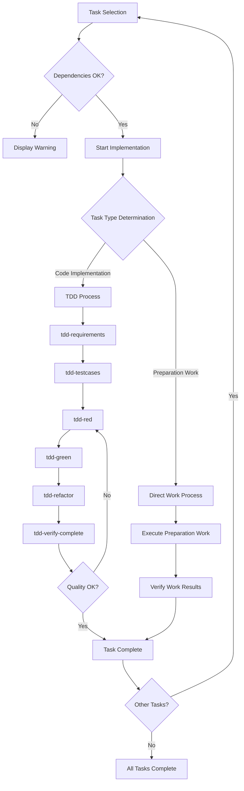

# kairo-implement

## English Quick Guide

This file contains detailed Japanese blocks below. Use this quick guide for an English-first overview.

- Implementation types:
  - TDD Process (for code implementation tasks)
  - Direct Work Process (for setup/config tasks)

TDD Process:

- Requirements Definition: run `tdd-requirements.md`
- Test Case Creation: run `tdd-testcases.md`
- Red (write failing tests): run `tdd-red.md`
- Green (minimal implementation): run `tdd-green.md`
- Refactor: run `tdd-refactor.md`
- Quality Verification: run `tdd-verify-complete.md`

Direct Work Process:

- Execute preparation work: create directories, configuration files, install dependencies, set up environment
- Verify preparation results: confirm outputs and readiness for next task

See command examples and detailed steps below.

## Purpose

Implement divided tasks in order, or implement user-specified tasks. Use existing TDD commands to perform high-quality implementation.

## Prerequisites

- Task list exists in `docs/tasks/{requirement-name}-tasks.md`
- User has approved task implementation
- Existing TDD commands are available
- Implementation workspace is set up

## Execution Content

**Reliability Level Instructions**:
For each item, briefly indicate the verification status with original materials using:

- 🟢 **Green**: Based on existing documents
- 🟡 **Yellow**: Reasonable inference from documents
- 🔴 **Red**: Requires speculation

1. **Task Selection**

   - Search for specified task ID using @agent-symbol-searcher and read found task files with Read tool
   - Confirm user-specified task ID
   - If no specification, automatically select next task based on dependencies
   - Display details of selected task

2. **Dependency Verification**

   - Search for dependent task status using @agent-symbol-searcher and read found task files with Read tool
   - Confirm if dependent tasks are completed
   - Warn if incomplete dependent tasks exist

3. **Implementation Directory Preparation**

   - Work in current workspace
   - Check directory structure as needed

4. **Implementation Type Determination**

   - Analyze task nature (code implementation vs preparation work)
   - Determine implementation method (TDD vs direct work)

5. **Implementation Process Execution**

   ### A. **TDD Process** (for code implementation tasks)

   a. **Requirements Definition** - `@task general-purpose tdd-requirements.md`

   ```text
   Task execution: TDD requirements definition phase
   Purpose: Describe detailed task requirements and clarify acceptance criteria
   Command: tdd-requirements.md
   Execution method: Individual Task execution
   ```

   b. **Test Case Creation** - `@task general-purpose tdd-testcases.md`

   ```markdown
   Task execution: TDD test case creation phase
   Purpose: Create unit test cases and consider edge cases
   Command: tdd-testcases.md
   Execution method: Individual Task execution
   ```

   c. **Test Implementation** - `@task general-purpose tdd-red.md`

   ```text
   Task execution: TDD Red phase
   Purpose: Implement failing tests and confirm that tests fail
   Command: tdd-red.md
   Execution method: Individual Task execution
   ```

   d. **Minimal Implementation** - `@task general-purpose tdd-green.md`

   ```text
   Task execution: TDD Green phase
   Purpose: Implement minimal code to make tests pass and avoid over-implementation
   Command: tdd-green.md
   Execution method: Individual Task execution
   ```

   e. **Refactoring** - `@task general-purpose tdd-refactor.md`

   ```text
   Task execution: TDD Refactoring phase
   Purpose: Improve code quality and maintainability
   Command: tdd-refactor.md
   Execution method: Individual Task execution
   ```

   f. **Quality Verification** - `@task general-purpose tdd-verify-complete.md`

   ```text
   Task execution: TDD quality verification phase
   Purpose: Confirm implementation completeness and repeat c-f if insufficient
   Command: tdd-verify-complete.md
   Execution method: Individual Task execution
   ```

   ### B. **Direct Work Process** (for preparation work tasks)

   a. **Preparation Work Execution** - `@task general-purpose direct-work-execute`

   ```text
   Task execution: Direct work execution phase
   Purpose: Create directories, configuration files, install dependencies, set up environment
   Work content:
   - Directory creation
   - Configuration file creation
   - Dependency installation
   - Environment setup
   Execution method: Individual Task execution
   ```

   b. **Work Result Verification** - `@task general-purpose direct-work-verify`

   ```text
   Task execution: Direct work verification phase
   Purpose: Verify work completion and confirm deliverables
   Work content:
   - Work completion verification
   - Expected deliverable confirmation
   - Next task preparation status confirmation
   Execution method: Individual Task execution
   ```

6. **Task Completion Processing**
   - Update task status (check checkbox in task file)
   - Document implementation results
   - Propose next task

## Execution Flow



## Command Execution Examples

```bash
# Implement all tasks in order
$ claude code kairo-implement --all

# Implement specific task
$ claude code kairo-implement --task TASK-101

# List parallel executable tasks
$ claude code kairo-implement --list-parallel

# Display current progress
$ claude code kairo-implement --status
```

## Implementation Type Determination Criteria

### TDD Process (Code Implementation Tasks)

Tasks that meet the following conditions:

- New component, service, hook, etc. implementation
- Existing code functionality addition/modification
- Business logic implementation
- API implementation

**Examples**: TaskService implementation, UI component creation, state management implementation

### Direct Work Process (Preparation Work Tasks)

Tasks that meet the following conditions:

- Project initialization/environment setup
- Directory structure creation
- Configuration file creation/update
- Dependency installation
- Tool setup/configuration

**Examples**: Project initialization, database setup, development environment setup

## Individual Task Execution Approach

### Task Execution Policy

Executing each implementation step as an individual Task provides the following benefits:

1. **Independence**: Each step is executed independently, making error isolation easier
2. **Re-executability**: Specific steps can be re-executed individually
3. **Parallelism**: Steps without dependencies can be executed in parallel
4. **Traceability**: Execution status and results of each step are clearly recorded

### Task Execution Pattern

```bash
# For TDD process
@task general-purpose tdd-requirements.md
@task general-purpose tdd-testcases.md
@task general-purpose tdd-red.md
@task general-purpose tdd-green.md
@task general-purpose tdd-refactor.md
@task general-purpose tdd-verify-complete.md

# For direct work process
@task general-purpose direct-work-execute
@task general-purpose direct-work-verify
```

## Implementation Notes

### For TDD Process

1. **Test First**

   - Always write tests first
   - Confirm tests fail before implementation

2. **Incremental Implementation**

   - Don't implement everything at once
   - Proceed with small steps

3. **Continuous Quality Verification**
   - Verify quality at each step
   - Don't create technical debt

### For Direct Work Process

1. **Phased Work Execution**

   - Execute in order considering dependencies
   - Confirm completion of each step

2. **Configuration Verification**

   - Verify operation of created configuration files
   - Check environment normality

3. **Documentation Updates**
   - Update documentation along with implementation
   - Make it understandable for other developers

## Output Format

### Task Start (TDD Process)

```text
🚀 Task TASK-101: Starting implementation of User Authentication API

📋 Task Details:
- Requirements: REQ-101, REQ-102
- Dependencies: TASK-002 ✅
- Estimated Time: 4 hours
- Implementation Type: TDD Process

🔄 Starting TDD process...
```

### Task Start (Direct Work Process)

```text
🚀 Task TASK-003: Starting implementation of Database Setup

📋 Task Details:
- Requirements: REQ-402, REQ-006
- Dependencies: TASK-001 ✅
- Estimated Time: 3 hours
- Implementation Type: Direct Work Process

🔧 Starting preparation work...
```

### Each Step Completion (TDD)

```text
✅ Task 1/6: @task tdd-requirements completed
   File: /implementation/{requirement-name}/TASK-101/requirements.md
   Task execution result: Requirements definition document creation completed

🏃 Task 2/6: @task tdd-testcases in progress...
   Task execution: Starting TDD test case creation phase
```

### Each Step Completion (Direct Work)

```text
✅ Task 1/2: @task direct-work-execute completed
   Created files: 8, Configuration updates: 3
   Task execution result: Preparation work execution completed

🏃 Task 2/2: @task direct-work-verify in progress...
   Task execution: Starting direct work verification phase
```

### Task Completion (TDD)

```text
🎉 Task TASK-101 completed!

✅ Updated task file checkbox
   - [ ] **Task Complete** → [x] **Task Complete**

📊 Implementation Summary:
- Implementation Type: TDD Process (Individual Task execution)
- Executed Task Steps: 6 (all successful)
- Created Files: 12
- Test Cases: 25 (all successful)
- Coverage: 95%
- Time Required: 3 hours 45 minutes

📝 Next Recommended Tasks:
- TASK-102: User Management API
- TASK-201: Login Screen (with dependencies)

Continue with implementation? (y/n)
```

### Task Completion (Direct Work)

```text
🎉 Task TASK-003 completed!

✅ Updated task file checkbox
   - [ ] **Task Complete** → [x] **Task Complete**

📊 Implementation Summary:
- Implementation Type: Direct Work Process (Individual Task execution)
- Executed Task Steps: 2 (all successful)
- Created Files: 8
- Configuration Updates: 3
- Environment Status: Normal
- Time Required: 2 hours 30 minutes

📝 Next Recommended Tasks:
- TASK-004: State Management Setup
- TASK-101: TaskService Implementation (with dependencies)

Continue with implementation? (y/n)
```

## Error Handling

- Incomplete dependent tasks: Display warning and request confirmation
- Test failures: Display detailed error information
- File conflicts: Create backup before overwriting

## Post-execution Verification

- Display list of implemented files
- Display test result summary
- Display remaining tasks and progress rate
- Display next task suggestions
