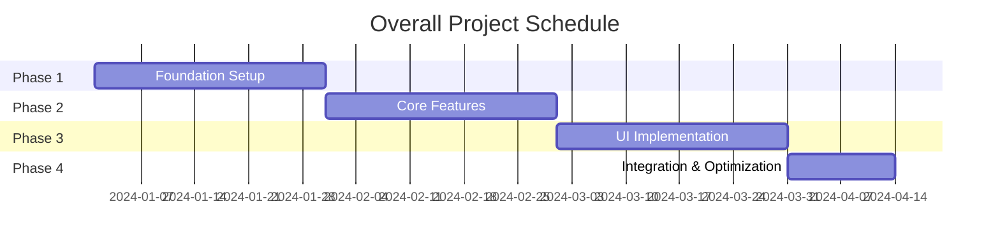

# kairo-tasks

## English Quick Guide

This document includes Japanese examples below. Use this section as an English-first summary.

- Goal: Split implementation into phased task files under `docs/tasks/{requirement-name}-*.md` with daily granularity and clear dependencies.
- Task metadata per item: Task ID, Name, Type (TDD/DIRECT), Requirements link, Dependencies, Implementation details, Test requirements, UI/UX requirements, Completion conditions.
- Phases: Create `overview.md` plus `phase1.md`, `phase2.md`, ... each listing day-level tasks with checkboxes and milestones.
- Numbering: Use `TASK-0001` format, assign consecutively across files without duplication.
- Output files:
  - `docs/tasks/{requirement-name}-overview.md`
  - `docs/tasks/{requirement-name}-phase1.md`, `-phase2.md`, ...
- After generation: verify inter-file links, dependency records, 4-digit ID format, and phase completion criteria.

See the detailed Japanese templates and Mermaid examples below.

## Purpose

Based on design documents, split implementation tasks into daily granularity and organize them into monthly phases. Create individual task files for each phase and manage them in appropriate order considering dependencies.

## Prerequisites

- Design documents exist in `docs/design/{requirement-name}/`
- Design has been approved by user (or approval is omitted)
- `docs/tasks/` directory exists (create if it doesn't exist)

## Execution Content

**【Reliability Level Instructions】**:
For each item, comment on the verification status with original materials (including EARS requirements definition and design documents) using the following signals:

- 🟢 **Green Signal**: When referring to EARS requirements definition and design documents with minimal speculation
- 🟡 **Yellow Signal**: When making reasonable speculation based on EARS requirements definition and design documents
- 🔴 **Red Signal**: When speculation is not based on EARS requirements definition and design documents

1. **Design Document Analysis**

   - Search for design documents using @agent-symbol-searcher and read found files with Read tool
   - Read `docs/design/{requirement-name}/architecture.md` with Read tool
   - Read `docs/design/{requirement-name}/database-schema.sql` with Read tool
   - Read `docs/design/{requirement-name}/api-endpoints.md` with Read tool
   - Read `docs/design/{requirement-name}/interfaces.ts` with Read tool
   - Read `docs/design/{requirement-name}/dataflow.md` with Read tool

2. **Existing Task File Verification**

   - Search for existing task IDs using @agent-symbol-searcher and read found task files with Read tool
   - Read existing `docs/tasks/{requirement-name}-*.md` files with Read tool
   - Extract used task numbers (TASK-0001 format)
   - Assign non-overlapping numbers for new tasks

3. **Task Identification**

   - Foundation tasks (DB setup, environment construction, etc.)
   - Backend tasks (API implementation)
   - Frontend tasks (UI implementation)
   - Integration tasks (E2E testing, etc.)

4. **Dependency Analysis**

   - Clarify dependencies between tasks
   - Identify tasks that can be executed in parallel
   - Identify critical path

5. **Task Detailing**
   Include the following for each task:

   - Task ID (4-digit number in TASK-0001 format)
   - Task name
   - Task Type (TDD/DIRECT)
     - **TDD**: Coding, business logic implementation, UI implementation, test implementation, etc. development work
     - **DIRECT**: Environment setup, configuration file creation, documentation creation, build configuration, etc. preparation work
   - Requirements link
   - Dependent tasks
   - Implementation details
   - Unit test requirements
   - Integration test requirements
   - UI/UX requirements (if applicable)
     - Loading states
     - Error display
     - Mobile compatibility
     - Accessibility requirements

6. **Task Ordering**

   - Determine execution order based on dependencies
   - Set milestones
   - Group tasks that can be executed in parallel

7. **Phase Division and File Creation**
   - Divide tasks into phases of approximately 1 month duration
   - Create individual task files for each phase
   - `docs/tasks/{requirement-name}-overview.md`: Overall overview and phase list
   - `docs/tasks/{requirement-name}-phase1.md`: Phase 1 detailed tasks
   - `docs/tasks/{requirement-name}-phase2.md`: Phase 2 detailed tasks
   - (Continue according to number of phases)
   - Design each task with daily granularity
   - Add checkboxes to each task to track completion status

## Output Format Examples

### 1. overview.md (Overall Overview)

````markdown
# {requirement-name} Implementation Tasks Overall Overview

## Project Overview

- **Requirement Name**: {requirement-name}
- **Total Duration**: {start date} ~ {planned end date}
- **Total Effort**: {effort}
- **Total Tasks**: {number}

## Phase Composition

| Phase                               | Duration | Major Deliverables                 | Task Count | Effort | File                   |
| ----------------------------------- | -------- | ---------------------------------- | ---------- | ------ | ---------------------- |
| Phase 1: Foundation                 | 1 month  | Development Environment & DB Setup | 20 tasks   | 160h   | [phase1.md](phase1.md) |
| Phase 2: Core Features              | 1 month  | Basic API & Authentication         | 22 tasks   | 176h   | [phase2.md](phase2.md) |
| Phase 3: UI Implementation          | 1 month  | Screens & Components               | 25 tasks   | 200h   | [phase3.md](phase3.md) |
| Phase 4: Integration & Optimization | 2 weeks  | Testing & Performance Tuning       | 10 tasks   | 80h    | [phase4.md](phase4.md) |

## Existing Task Number Management

**Existing File Verification Results**:

- Verified files: `docs/tasks/{requirement-name}-*.md`
- Used task numbers: TASK-0001 ~ TASK-0077 (example)
- Next starting number: TASK-0078

## Dependencies


````

## Progress Management

### Overall Progress

- [ ] Phase 1: Foundation Setup (0/20)
- [ ] Phase 2: Core Features (0/22)
- [ ] Phase 3: UI Implementation (0/25)
- [ ] Phase 4: Integration & Optimization (0/10)

### Milestones

- [ ] M1: Development Environment Complete (Phase 1 completion)
- [ ] M2: MVP Features Complete (Phase 2 completion)
- [ ] M3: UI Complete (Phase 3 completion)
- [ ] M4: Release Preparation Complete (Phase 4 completion)

## Risk Management

| Risk        | Impact       | Probability  | Countermeasures          |
| ----------- | ------------ | ------------ | ------------------------ |
| {Risk Item} | High/Med/Low | High/Med/Low | {Countermeasure content} |

## Quality Standards

- Test Coverage: 90% or higher
- Performance: Response time within 3 seconds
- Security: OWASP Top 10 compliance
- Accessibility: WCAG 2.1 AA compliance

````

### 2. phase*.md (Each Phase Details)

```markdown
# {requirement-name} Phase 1: Foundation Setup

## Phase Overview

- **Duration**: 1 month (20 business days)
- **Goal**: Development environment and database foundation setup
- **Deliverables**: Working development environment, database schema, CI/CD foundation
- **Responsible**: {responsible person}

## Weekly Planning

### Week 1: Environment Setup

- **Goal**: Basic development environment setup
- **Deliverables**: Docker environment, basic configuration

### Week 2: Database Design

- **Goal**: Database schema implementation
- **Deliverables**: DB design, migrations

### Week 3: CI/CD Setup

- **Goal**: Automation pipeline setup
- **Deliverables**: Test & deployment automation

### Week 4: Foundation Testing & Adjustment

- **Goal**: Foundation stabilization
- **Deliverables**: Verified working foundation

## Daily Tasks

### Week 1: Environment Setup

#### Day 1 (TASK-0001): Project Initialization

- [ ] **Task Complete**
- **Estimated Effort**: 8 hours
- **Task Type**: DIRECT
- **Requirements Link**: REQ-001
- **Dependent Tasks**: None
- **Implementation Details**:
  - Node.js/TypeScript environment setup
  - package.json configuration
  - ESLint/Prettier configuration
  - Git initialization & .gitignore setup
- **Completion Criteria**:
  - [ ] Development server starts with npm run dev
  - [ ] No errors with npm run lint
  - [ ] TypeScript configuration works correctly
- **Notes**: Use Node.js LTS version

#### Day 2 (TASK-0002): Docker Environment Setup

- [ ] **Task Complete**
- **Estimated Effort**: 8 hours
- **Task Type**: DIRECT
- **Requirements Link**: REQ-002
- **Dependent Tasks**: TASK-0001
- **Implementation Details**:
  - Dockerfile creation
  - docker-compose.yml configuration
  - PostgreSQL & Redis configuration
  - Environment variable management setup
- **Completion Criteria**:
  - [ ] All services start with docker-compose up
  - [ ] Application can connect to DB
  - [ ] Hot reload works
- **Notes**: Be careful of port conflicts

#### Day 3 (TASK-0003): Basic Directory Structure

- [ ] **Task Complete**
- **Estimated Effort**: 6 hours
- **Task Type**: DIRECT
- **Requirements Link**: REQ-003
- **Dependent Tasks**: TASK-0002
- **Implementation Details**:
  - src/ directory structure creation
  - Test directory structure
  - Configuration file placement
  - README.md creation
- **Completion Criteria**:
  - [ ] Structure follows Clean Architecture
  - [ ] Test file placement is correct
  - [ ] README.md is comprehensive
- **Notes**: Design carefully as structure is difficult to change later

#### Day 4 (TASK-0004): Logging & Error Handling Foundation

- [ ] **Task Complete**
- **Estimated Effort**: 8 hours
- **Task Type**: TDD
- **Requirements Link**: REQ-004
- **Dependent Tasks**: TASK-0003
- **Implementation Details**:
  - Winston/Pino logging library configuration
  - Error handling middleware
  - Structured logging configuration
  - Log rotation configuration
- **Test Requirements**:
  - [ ] Log output tests
  - [ ] Error handling tests
  - [ ] Log level control tests
- **Completion Criteria**:
  - [ ] Each log level outputs correctly
  - [ ] Errors are caught appropriately
  - [ ] Sensitive information not output in production

#### Day 5 (TASK-0005): Configuration Management System

- [ ] **Task Complete**
- **Estimated Effort**: 6 hours
- **Task Type**: TDD
- **Requirements Link**: REQ-005
- **Dependent Tasks**: TASK-0004
- **Implementation Details**:
  - Environment-specific configuration files
  - Configuration validation
  - Sensitive information management
  - Configuration loading module
- **Test Requirements**:
  - [ ] Configuration loading tests
  - [ ] Environment-specific configuration tests
  - [ ] Configuration validation tests
- **Completion Criteria**:
  - [ ] Environment variables loaded correctly
  - [ ] Errors occur with invalid configuration
  - [ ] Sensitive information managed appropriately

### Week 2: Database Design

#### Day 6 (TASK-0006): Database Connection Foundation

- [ ] **Task Complete**
- **Estimated Effort**: 8 hours
- **Task Type**: TDD
- **Requirements Link**: REQ-401
- **Dependent Tasks**: TASK-0005
- **Implementation Details**:
  - TypeORM/Prisma configuration
  - Connection pool configuration
  - Migration foundation
  - Database monitoring
- **Test Requirements**:
  - [ ] Connection pool tests
  - [ ] Connection failure handling tests
  - [ ] Transaction management tests
- **Completion Criteria**:
  - [ ] Database connection is stable
  - [ ] Connection pool works appropriately
  - [ ] Migration commands work

{...Continue, document Day 7-20 in same format...}

## Phase Completion Criteria

- [ ] All tasks completed (20/20)
- [ ] Development environment works stably
- [ ] Database schema is complete
- [ ] CI/CD pipeline works
- [ ] Foundation code test coverage is 90% or higher
- [ ] Security checks completed
- [ ] Documentation is organized

## Handover Items to Next Phase

- Development environment usage methods
- Database schema details
- CI/CD operation methods
- Configuration item list
- Troubleshooting information

## Retrospective

### Differences from Plan

- {Record differences between plan and actual}

### Learning Points

- {Record technical learning points}

### Improvement Points

- {Record points to improve in next phase}

```markdown
## Subtask Template

### For TDD Tasks

Each task is implemented with the following TDD process:

1. `tdd-requirements.md` - Detailed requirements definition
2. `tdd-testcases.md` - Test case creation
3. `tdd-red.md` - Test implementation (failure)
4. `tdd-green.md` - Minimal implementation
5. `tdd-refactor.md` - Refactoring
6. `tdd-verify-complete.md` - Quality verification

### For DIRECT Tasks

Each task is implemented with the following DIRECT process:

1. `direct-setup.md` - Direct implementation & configuration
2. `direct-verify.md` - Operation verification & quality verification
````

## Post-execution Verification

- Verify consistency between created tasks and existing system using @agent-symbol-searcher
- Display list of created files
  - `docs/tasks/{requirement-name}-overview.md`: Overall overview and phase list
  - `docs/tasks/{requirement-name}-phase1.md`: Phase 1 details
  - `docs/tasks/{requirement-name}-phase2.md`: Phase 2 details
  - (Continue according to number of phases)
- Display overview and task count for each phase
- Display overall schedule and dependencies
- Report project duration and total workload
- **Display existing task number verification results**
  - Used numbers extracted from existing files
  - Starting number for new tasks
  - Verify consecutive number assignment without duplication
- Display message prompting user confirmation to start implementation

## File Link Verification

- Verify that links from overview.md to each phase\*.md are correctly set
- Verify that task dependencies within each phase file are correctly recorded
- **Verify that all task IDs are unified in 4-digit TASK-0001 format**
- Verify that milestones and phase completion criteria are clearly defined

## Task Number Management Notes

- Always check used numbers with Grep tool if existing files exist
- Support maximum 9999 tasks from TASK-0001 to TASK-9999
- Carefully manage to prevent number duplication or gaps
- Assign task numbers consecutively even across multiple phase files
