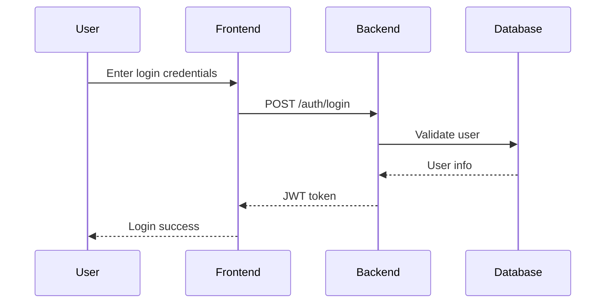
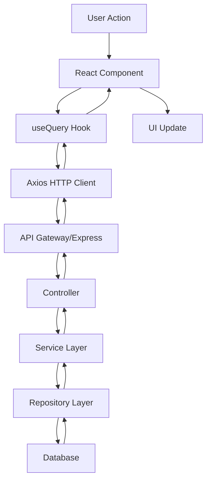
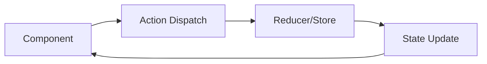
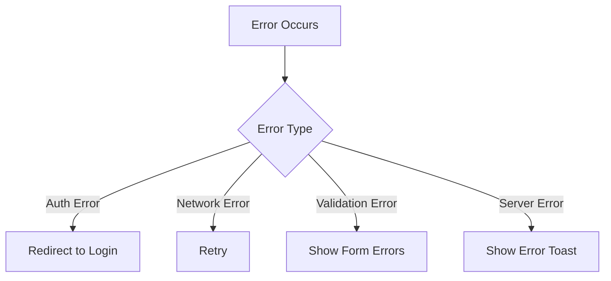

# rev-design

## Purpose

Reverse-generate technical design documents from an existing codebase. Analyze implemented architecture, data flows, API specifications, database schema, and TypeScript interfaces, and document them as design artifacts.

## Prerequisites

- The target codebase to analyze exists
- The `docs/reverse/` directory exists (create it if it does not)
- Preferably, `rev-tasks.md` has been executed beforehand

## Execution Content

1. **Architecture Analysis**

   - Identify architecture patterns from the project structure
   - Check layer composition (e.g., MVC, Clean Architecture)
   - Determine whether microservices are used
   - Check separation between frontend/backend

2. **Data Flow Extraction**

   - User interaction flows
   - API call flows
   - Database access patterns
   - State management flows

3. **API Specification Extraction**

   - Generate a list of endpoints
   - Analyze request/response structures
   - Confirm authentication/authorization methods
   - Error response formats

4. **Reverse-generate Database Schema**

   - Extract table definitions
   - Analyze relationships
   - Check index settings
   - Extract constraints

5. **Organize TypeScript Type Definitions**

   - Extract entity types
   - Extract API types
   - Organize common types
   - Analyze type dependencies

6. **Component Design Analysis**

   - UI component hierarchy
   - Props interfaces
   - State management design
   - Routing design

7. **File Creation**
   - `docs/reverse/{project-name}-architecture.md` - Architecture overview
   - `docs/reverse/{project-name}-dataflow.md` - Data flow diagrams
   - `docs/reverse/{project-name}-api-specs.md` - API specifications
   - `docs/reverse/{project-name}-database.md` - Database design
   - `docs/reverse/{project-name}-interfaces.ts` - Aggregated type definitions

## Output Format Examples

### architecture.md

```markdown
# {project-name} Architecture Design (Reverse-Generated)

## Analysis Date/Time

{execution timestamp}

## System Overview

### Implemented Architecture

- **Pattern**: {identified architecture pattern}
- **Framework**: {frameworks used}
- **Composition**: {observed composition}

### Tech Stack

#### Frontend

- **Framework**: {React/Vue/Angular, etc.}
- **State Management**: {Redux/Zustand/Pinia, etc.}
- **UI Library**: {Material-UI/Ant Design, etc.}
- **Styling**: {CSS Modules/styled-components, etc.}

#### Backend

- **Framework**: {Express/NestJS/FastAPI, etc.}
- **Authentication**: {JWT/Session/OAuth, etc.}
- **ORM/Data Access**: {TypeORM/Prisma/Sequelize, etc.}
- **Validation**: {Joi/Yup/zod, etc.}

#### Database

- **DBMS**: {PostgreSQL/MySQL/MongoDB, etc.}
- **Cache**: {Redis/Memcached, or none}
- **Connection Pool**: {present or not}

#### Infra/Tools

- **Build Tools**: {Webpack/Vite/Rollup, etc.}
- **Test Frameworks**: {Jest/Vitest/Pytest, etc.}
- **Code Quality**: {ESLint/Prettier/SonarQube, etc.}

## Layered Architecture

### Discovered Layers
```

{actual directory structure}

```

### Layer Responsibilities Analysis
- **Presentation Layer**: {status}
- **Application Layer**: {status}
- **Domain Layer**: {status}
- **Infrastructure Layer**: {status}

## Design Patterns

### Identified Patterns
- **Dependency Injection**: {present or not}
- **Repository Pattern**: {present or not}
- **Factory Pattern**: {usage locations}
- **Observer Pattern**: {usage locations}
- **Strategy Pattern**: {usage locations}

## Non-functional Requirement Implementations

### Security
- **Authentication**: {method}
- **Authorization**: {method}
- **CORS**: {configured or not}
- **HTTPS**: {enforced or not}

### Performance
- **Cache**: {status}
- **DB Optimization**: {indexes, etc.}
- **CDN**: {usage}
- **Image Optimization**: {status}

### Operations/Monitoring
- **Logging**: {status}
- **Error Tracking**: {status}
- **Metrics**: {status}
- **Health Check**: {status}
```

### dataflow.md

````markdown
# Data Flow Diagram (Reverse-Generated)

## User Interaction Flow

### Authentication Flow


````

### Data Fetch Flow



## State Management Flow

### {State Management Library Used}



## Error Handling Flow



````

### api-specs.md

```markdown
# API Specifications (Reverse-Generated)

## Base URL
`{discovered base URL}`

## Authentication Method
{details of the discovered auth method}

## Endpoints

### Authentication

#### POST /auth/login
**Description**: User login

**Request**:
```typescript
{
  email: string;
  password: string;
}
````

**Response**:

```typescript
{
  success: boolean;
  data: {
    token: string;
    user: {
      id: string;
      email: string;
      name: string;
    }
  }
}
```

**Error Response**:

```typescript
{
  success: false;
  error: {
    code: string;
    message: string;
  }
}
```

#### POST /auth/logout

**Description**: User logout

**Headers**:

```
Authorization: Bearer {token}
```

### {Other Endpoints}

## Error Codes

| Code      | Message             | Description                        |
| --------- | ------------------- | ---------------------------------- |
| AUTH_001  | Invalid credentials | Invalid authentication information |
| AUTH_002  | Token expired       | Token has expired                  |
| VALID_001 | Validation failed   | Validation error                   |

## Common Response Formats

### Success Response

```typescript
{
  success: true;
  data: T; // varies per endpoint
}
```

### Error Response

```typescript
{
  success: false;
  error: {
    code: string;
    message: string;
    details?: any;
  }
}
```

````

### database.md

```markdown
# Database Design (Reverse-Generated)

## Schema Overview

### Table List
{discovered tables}

### ER Diagram
```mermaid
erDiagram
    USERS {
        uuid id PK
        varchar email UK
        varchar name
        timestamp created_at
        timestamp updated_at
    }

    POSTS {
        uuid id PK
        uuid user_id FK
        varchar title
        text content
        timestamp created_at
        timestamp updated_at
    }

    USERS ||--o{ POSTS : creates
````

## Table Details

### users table

```sql
{actual CREATE TABLE statement}
```

**Column Descriptions**:

- `id`: {description}
- `email`: {description}
- `name`: {description}

**Indexes**:

- `idx_users_email`: for email column lookup

### {Other Tables}

## Constraints & Relationships

### Foreign Keys

{discovered foreign key constraints}

### Unique Constraints

{discovered unique constraints}

## Data Access Patterns

### Common Queries

{query patterns discovered from code}

### Performance Considerations

{discovered index strategies}

````

### interfaces.ts

```typescript
// ======================
// Entity Type Definitions
// ======================

export interface User {
  id: string;
  email: string;
  name: string;
  createdAt: Date;
  updatedAt: Date;
}

export interface Post {
  id: string;
  userId: string;
  title: string;
  content: string;
  createdAt: Date;
  updatedAt: Date;
  user?: User;
}

// ======================
// API Type Definitions
// ======================

export interface LoginRequest {
  email: string;
  password: string;
}

export interface LoginResponse {
  success: boolean;
  data: {
    token: string;
    user: User;
  };
}

export interface ApiResponse<T = any> {
  success: boolean;
  data?: T;
  error?: {
    code: string;
    message: string;
    details?: any;
  };
}

// ======================
// Component Props Types
// ======================

export interface LoginFormProps {
  onSubmit: (data: LoginRequest) => void;
  loading?: boolean;
  error?: string;
}

// ======================
// State Management Types
// ======================

export interface AuthState {
  user: User | null;
  token: string | null;
  isAuthenticated: boolean;
  loading: boolean;
}

// ======================
// Configuration Types
// ======================

export interface AppConfig {
  apiBaseUrl: string;
  tokenStorageKey: string;
  supportedLanguages: string[];
}
````

## Analysis Algorithm

### 1. File Scanning & Pattern Matching

- Extract functions/classes/interfaces via AST analysis
- Analyze config files with regex where applicable
- Infer architecture from directory structure

### 2. Automatic API Spec Generation

- Parse Express/NestJS route definitions
- Parse FastAPI schema definitions
- Infer request/response from TypeScript types

### 3. Database Schema Extraction

- Parse migration files
- Parse ORM model definitions
- Parse SQL files

## Example Commands

```bash
# Full analysis (generate all design docs)
claude code rev-design

# Generate specific design docs only
claude code rev-design --target architecture
claude code rev-design --target api
claude code rev-design --target database

# Analyze a specific directory
claude code rev-design --path ./backend

# Specify output formats
claude code rev-design --format markdown,openapi
```

## Post-execution Verification

- Display the list of generated design files
- Show statistics such as extracted API count, table count, and type definition count
- Present missing design elements and recommended improvements
- Propose the next reverse-engineering step (e.g., generating requirements)
